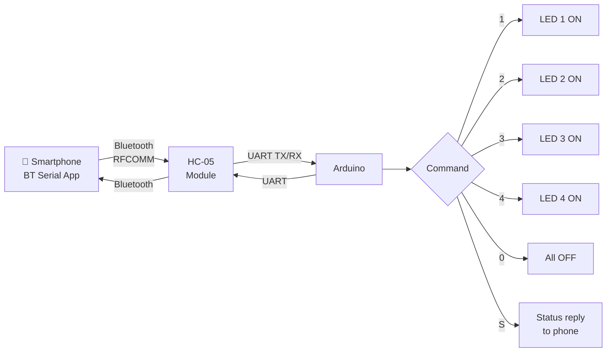

# Bluetooth — Wireless LED & Relay Controller

> HC-05 · Arduino · Smartphone App

Pairs the Arduino with a smartphone via Bluetooth. Send single-character commands from any BT serial app (e.g. Serial Bluetooth Terminal) to control 4 output pins — LEDs, relays, or any GPIO device. No WiFi or internet required.

---

## Demo
> 📷 _Add photo to `assets/` and link here_

---

## Pipeline



---

## Components

| Component | Qty |
|-----------|-----|
| Arduino Uno/Mega | 1 |
| HC-05 Bluetooth Module | 1 |
| LEDs or relay channels | 4 |
| 1kΩ + 2kΩ resistors | 1 set |

**Phone app:** "Serial Bluetooth Terminal" (Android) or "BlueSee" (iOS)

---

## Wiring

```
HC-05        Arduino
─────        ───────
VCC   ──────► 5V
GND   ──────► GND
TXD   ──────► Pin 10 (SoftwareSerial RX)
RXD   ──────► Pin 11 via voltage divider ← IMPORTANT
              (HC-05 RX is 3.3V — use 1kΩ + 2kΩ divider)

Voltage divider on TX line (Arduino → HC-05):
Arduino Pin 11 → 1kΩ → HC-05 RXD
                        2kΩ ↓
                        GND

Outputs:
LED/Relay 1 ──► Pin 4
LED/Relay 2 ──► Pin 5
LED/Relay 3 ──► Pin 6
LED/Relay 4 ──► Pin 7
```

---

## Code

```cpp
#include <SoftwareSerial.h>

SoftwareSerial bt(10, 11); // RX, TX

const int OUTPUTS[4] = {4, 5, 6, 7};
bool state[4] = {false, false, false, false};

void setOutput(int ch, bool on) {
  state[ch] = on;
  digitalWrite(OUTPUTS[ch], on ? HIGH : LOW);
}

void sendStatus() {
  for (int i = 0; i < 4; i++) {
    bt.print("CH"); bt.print(i+1); bt.print(":"); bt.println(state[i] ? "ON" : "OFF");
  }
}

void setup() {
  Serial.begin(9600);
  bt.begin(9600);
  for (int p : OUTPUTS) { pinMode(p, OUTPUT); digitalWrite(p, LOW); }
  bt.println("BT Controller Ready — cmds: 1 2 3 4 0 S");
  Serial.println("Waiting for Bluetooth connection...");
}

void loop() {
  if (bt.available()) {
    char c = bt.read();
    if (c >= '1' && c <= '4') {
      int ch = c - '1';
      setOutput(ch, !state[ch]); // Toggle
      bt.print("CH"); bt.print(ch+1); bt.println(state[ch] ? ":ON" : ":OFF");
    } else if (c == '0') {
      for (int i=0;i<4;i++) setOutput(i, false);
      bt.println("All OFF");
    } else if (c == 'S' || c == 's') {
      sendStatus();
    }
  }
}
```

---

## How to run

1. Wire HC-05 with voltage divider on the RXD line (3.3V logic).
2. Pair HC-05 in phone Bluetooth settings (default PIN: `1234` or `0000`).
3. Open "Serial Bluetooth Terminal" → connect to HC-05.
4. Send `1`, `2`, `3`, `4` to toggle outputs. `0` = all off. `S` = status.
