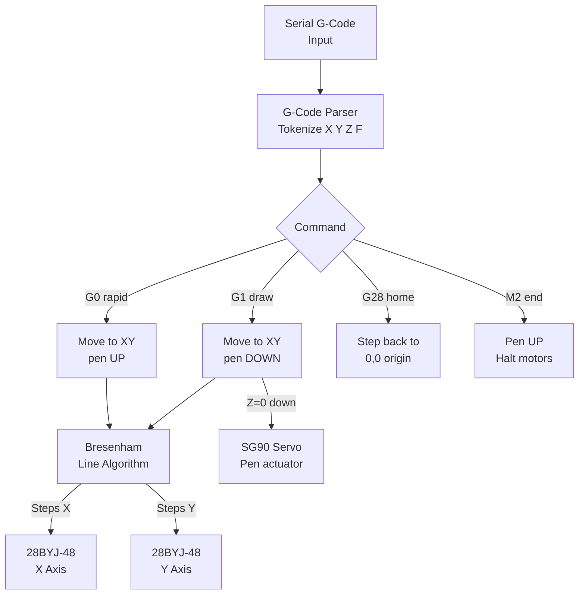

# CNC Pen Plotter — 2-Axis G-Code

> 2× 28BYJ-48 Steppers · SG90 Pen Servo · G-Code Parser · Arduino

A **2-axis CNC plotter** that accepts a minimal G-code subset via Serial and draws on paper. X and Y axes are driven by 28BYJ-48 steppers, and a servo lifts/lowers the pen. Implements `G0` (rapid move), `G1` (linear draw), `G28` (home), and `M2` (end program). Send a G-code file from Python or any terminal.

---

## Demo
> 📷 _Add drawing photo or video to `assets/`_

---

## Pipeline



---

## Components

| Component | Qty |
|-----------|-----|
| Arduino Uno/Mega | 1 |
| 28BYJ-48 stepper + ULN2003 driver | 2 |
| SG90 servo (pen lift) | 1 |
| Frame / gantry (LEGO, 3D print, or acrylic) | 1 |

---

## Wiring

```
X-axis ULN2003: IN1–IN4 ──► Pins 2,3,4,5
Y-axis ULN2003: IN1–IN4 ──► Pins 6,7,8,9
Pen servo signal         ──► Pin 10
Servo VCC ──► 5V (separate supply recommended)
```

---

## G-Code Subset Supported

```gcode
G28           ; Home all axes
G0 X50 Y30   ; Move pen up to X=50mm Y=30mm
G1 X80 Y60   ; Draw line to X=80mm Y=60mm
G1 X50 Y30   ; Draw line back
M2            ; End / pen up
```

---

## Python sender snippet

```python
import serial, time
port = serial.Serial('COM3', 9600, timeout=2)
with open('drawing.gcode') as f:
    for line in f:
        port.write((line.strip() + '\n').encode())
        while b'OK' not in port.readline(): pass
```

---

## Code

See [code.ino](./code.ino) — Bresenham line algorithm for simultaneous dual-axis stepping, configurable steps/mm for your frame geometry, `OK\n` handshake for flow control.
