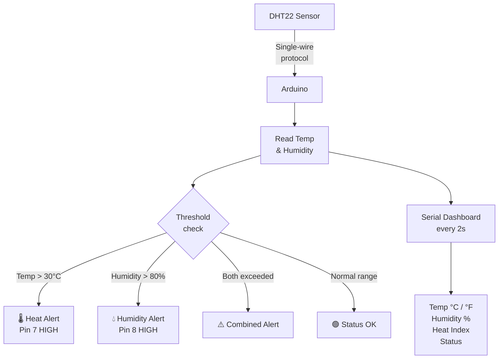

# DHT22 — Environmental Monitor with Alerts

> DHT22 · Arduino · Serial Dashboard · Threshold Alerts

A real-time environmental monitoring station that tracks temperature and humidity, displays a live dashboard in the Serial Monitor, and triggers configurable alerts when thresholds are exceeded. Designed to be extended with an LCD display, data logger, or IoT backend.

---

## Demo

> 📷 _Add your build photo to `assets/` and link it here_
> <!--  -->

**Reference guide:** [Random Nerd Tutorials — DHT22 Complete Guide](https://randomnerdtutorials.com/complete-guide-for-dht11dht22-humidity-and-temperature-sensor-with-arduino/)

---

## Pipeline



---

## Components

| Component | Qty | Notes |
|-----------|-----|-------|
| Arduino Uno / Mega | 1 | |
| DHT22 Sensor | 1 | −40°C to +80°C, 0–100% RH |
| 10kΩ resistor | 1 | Pull-up on DATA line |
| LED (red) | 1 | Temperature alert indicator |
| LED (blue) | 1 | Humidity alert indicator |
| 220Ω resistors | 2 | One per LED |
| Breadboard + wires | — | |

**Required library:** `DHT sensor library` by Adafruit
→ Arduino IDE: Sketch → Include Library → Manage Libraries → search `DHT sensor library`

---

## Wiring

```
DHT22             Arduino
─────             ───────
Pin 1 (VCC) ───► 5V
Pin 2 (DATA)───► Pin 2  (+ 10kΩ pull-up to 5V)
Pin 3 (NC)       not connected
Pin 4 (GND) ───► GND

Alert LEDs (each with 220Ω to GND)
Red  LED    ───► Pin 7  (temperature alert)
Blue LED    ───► Pin 8  (humidity alert)
```

```
5V ──┬── DHT22 VCC
     │
    10kΩ
     │
     └── DHT22 DATA ── Arduino Pin 2
```

---

## Code

```cpp
#include <DHT.h>

#define DHT_PIN    2
#define DHT_TYPE   DHT22
#define LED_TEMP   7
#define LED_HUM    8

const float TEMP_MAX = 30.0;  // °C
const float HUM_MAX  = 80.0;  // %

DHT dht(DHT_PIN, DHT_TYPE);

void printDashboard(float hum, float tempC, float tempF, float hi) {
  Serial.println("╔══════════════════════════╗");
  Serial.print  ("║ Temp:   "); Serial.print(tempC, 1);
  Serial.print  (" °C  /  "); Serial.print(tempF, 1); Serial.println(" °F ║");
  Serial.print  ("║ Humidity: "); Serial.print(hum, 1); Serial.println(" %           ║");
  Serial.print  ("║ Heat idx: "); Serial.print(hi,  1); Serial.println(" °C          ║");
  bool tAlert = tempC > TEMP_MAX;
  bool hAlert = hum   > HUM_MAX;
  Serial.print  ("║ Status: ");
  if (!tAlert && !hAlert) Serial.println("OK ✓                    ║");
  else {
    if (tAlert) Serial.print("HEAT ALERT ");
    if (hAlert) Serial.print("HUMIDITY ALERT ");
    Serial.println("║");
  }
  Serial.println("╚══════════════════════════╝");
  Serial.println();
}

void setup() {
  Serial.begin(9600);
  dht.begin();
  pinMode(LED_TEMP, OUTPUT);
  pinMode(LED_HUM,  OUTPUT);
  Serial.println("Environmental Monitor — Ready");
  Serial.println();
}

void loop() {
  delay(2000);

  float hum   = dht.readHumidity();
  float tempC = dht.readTemperature();
  float tempF = dht.readTemperature(true);

  if (isnan(hum) || isnan(tempC)) {
    Serial.println("ERROR: Sensor read failed");
    return;
  }

  float heatIndex = dht.computeHeatIndex(tempC, hum, false);

  digitalWrite(LED_TEMP, tempC > TEMP_MAX);
  digitalWrite(LED_HUM,  hum   > HUM_MAX);

  printDashboard(hum, tempC, tempF, heatIndex);
}
```

---

## Serial dashboard output

```
╔══════════════════════════╗
║ Temp:   24.3 °C  /  75.7 °F ║
║ Humidity: 61.5 %           ║
║ Heat idx: 24.1 °C          ║
║ Status: OK ✓                    ║
╚══════════════════════════╝

╔══════════════════════════╗
║ Temp:   31.2 °C  /  88.2 °F ║
║ Humidity: 83.0 %           ║
║ Heat idx: 35.4 °C          ║
║ Status: HEAT ALERT HUMIDITY ALERT ║
╚══════════════════════════╝
```

---

## Extensions

| Add-on | What it enables |
|--------|----------------|
| 16×2 LCD (I2C) | Standalone display — no PC needed |
| SD card module | Log data to CSV for analysis |
| FastAPI backend | Send readings to a database via serial → Python |
| ESP8266 / WiFi | Push readings to an IoT dashboard |

---

**Reference guide:** [Adafruit DHT Sensor Library](https://learn.adafruit.com/dht)
