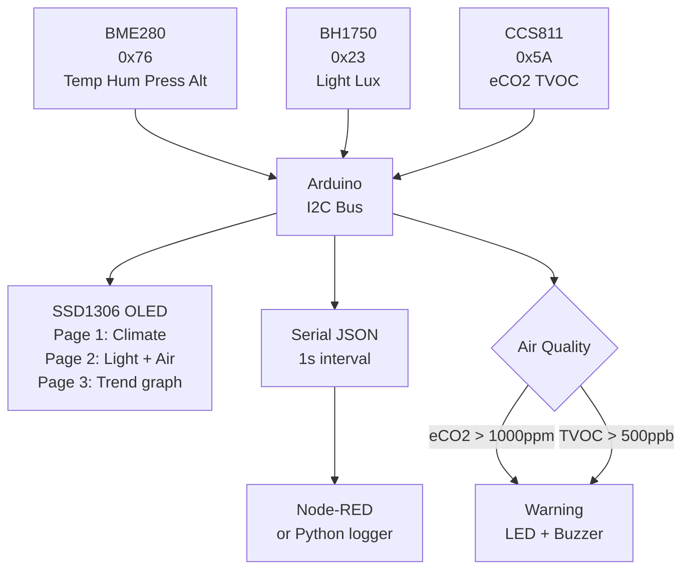

# Environmental Sensor Dashboard

> BME280 · BH1750 · CCS811 eCO2/TVOC · OLED · Multi-I2C · Arduino

A multi-sensor environmental monitor combining **temperature, humidity, pressure, light lux, eCO2, and TVOC** from three I2C sensors on one bus. Displays a multi-page OLED dashboard that auto-cycles, color-codes air quality status, and streams all readings as JSON over Serial for logging or Node-RED dashboards.

---

## Demo
> 📷 _Add photo to `assets/`_

---

## Pipeline



---

## Components

| Component | Qty |
|-----------|-----|
| Arduino Uno/Mega | 1 |
| BME280 breakout (I2C) | 1 |
| BH1750 light sensor (I2C) | 1 |
| CCS811 air quality sensor (I2C) | 1 |
| SSD1306 0.96" OLED I2C | 1 |
| Red LED + Buzzer | 1 each |

**Libraries:** `Adafruit_BME280`, `BH1750`, `Adafruit_CCS811`, `Adafruit_SSD1306`

> CCS811 requires BME280 temperature + humidity compensation for accurate readings.

---

## Wiring

```
All sensors on I2C bus:
  SDA ──► A4    SCL ──► A5    VCC ──► 3.3V    GND ──► GND

I2C addresses:
  BME280: 0x76    BH1750: 0x23    CCS811: 0x5A    OLED: 0x3C

Alert LED: Pin 7 via 220Ω    Buzzer: Pin 8
CCS811 WAKE pin ──► GND (always enabled)
```

---

## JSON Serial Output

```json
{"ts":1717768921,"temp":23.4,"hum":52.1,"press":1013.2,"alt":45,"lux":342,"eco2":623,"tvoc":41,"aqi":"GOOD"}
```

---

## Air Quality Index

| eCO2 (ppm) | Status | Color |
|------------|--------|-------|
| < 600 | Excellent | — |
| 600–1000 | Good | — |
| 1000–1500 | Moderate | Warn LED |
| > 1500 | Poor | LED + Buzzer |

---

## Code

See [code.ino](./code.ino) — 3-page OLED auto-cycle (5s each), BME280 compensation data fed to CCS811, rolling 20-sample lux average, JSON serial stream parseable by Node-RED mqtt-in or Python serial.readline().
