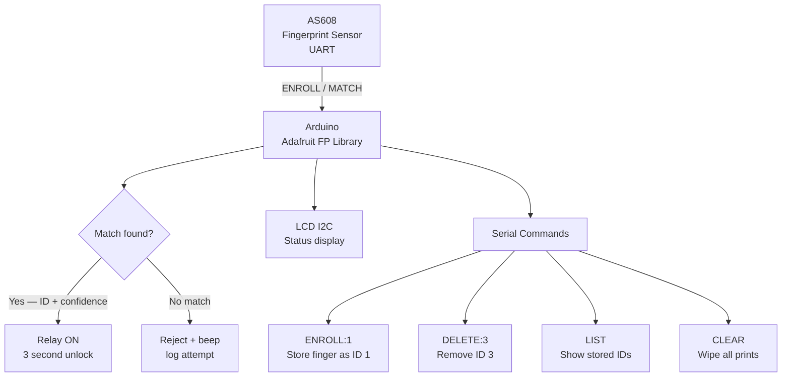

# Biometric Fingerprint Lock

> AS608 · Relay · LCD I2C · Enrollment Mode · Arduino

Controls a door lock relay using an **AS608 optical fingerprint sensor**. Supports enrolling up to 127 fingerprints, deleting IDs, and listing stored prints — all via Serial commands. A 16×2 LCD shows status. Matched prints unlock for 3 seconds; unknown prints log the attempt and reject.

---

## Demo
> 📷 _Add photo to `assets/`_

---

## Pipeline



---

## Components

| Component | Qty |
|-----------|-----|
| Arduino Uno/Mega | 1 |
| AS608 Optical Fingerprint Sensor | 1 |
| 5V Relay Module (active-LOW) | 1 |
| 16×2 LCD I2C (0x27) | 1 |
| Green + Red LEDs | 1 each |
| Buzzer | 1 |
| Electric door strike or solenoid | 1 |

**Library:** `Adafruit Fingerprint Sensor Library`

---

## Wiring

```
AS608 Sensor     Arduino
────────────     ───────
VCC (3.3V) ──► 3.3V
GND        ──► GND
TX (green) ──► Pin 2 (SoftwareSerial RX)
RX (white) ──► Pin 3 (SoftwareSerial TX) via 1kΩ
```

> AS608 UART is 3.3V logic. Use a voltage divider or logic level shifter on the TX→Arduino RX line.

---

## Serial Commands

```
ENROLL:1     — Enroll a new finger as ID 1 (prompted two touches)
DELETE:1     — Remove fingerprint ID 1
LIST         — Print all occupied ID slots
CLEAR        — Wipe entire fingerprint database
STATUS       — Show sensor info and template count
```

---

## Code

See [code.ino](./code.ino) — full enroll flow (2 captures + model creation), fast verify loop (< 1s), confidence threshold of 50 to reject weak matches.
