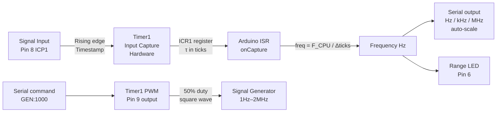

# Frequency Counter & Signal Generator

> Timer1 Hardware · Input Capture · PWM Output · Arduino

Measures input signal frequency from **1 Hz to 8 MHz** using Timer1's hardware Input Capture Unit — no polling, no delays, no missed edges. Simultaneously generates a calibrated square wave on Pin 9 using Timer1 PWM for testing. Displays frequency and period on Serial and triggers a gate LED.

---

## Demo
> 📷 _Add photo or oscilloscope screenshot to `assets/`_

---

## Pipeline



---

## Components

| Component | Qty |
|-----------|-----|
| Arduino Uno/Mega | 1 |
| Signal source (function gen, another Arduino, sensor) | 1 |
| LED (range indicator) | 1 |
| 10kΩ resistor (input protection) | 1 |
| Oscilloscope (optional, for verification) | – |

---

## Wiring

```
Signal Input
  Source ──► Pin 8 (ICP1) via 10kΩ series resistor
  Signal GND ──► Arduino GND

Signal Generator Output
  Pin 9 ──► Oscilloscope or circuit under test

Range LED: Pin 6 via 220Ω → GND
```

> Input is 5V tolerant. For 3.3V signals connect directly. For signals > 5V use a voltage divider.

---

## Measurement Ranges

| Range | Resolution | Prescaler |
|-------|-----------|-----------|
| 1 Hz – 100 Hz | 0.01 Hz | 256 |
| 100 Hz – 10 kHz | 1 Hz | 8 |
| 10 kHz – 8 MHz | 100 Hz | 1 |

Auto-ranging: switches prescaler based on measured period.

---

## Serial Commands

```
GEN:1000       — Generate 1000 Hz square wave on Pin 9
GEN:440        — Generate 440 Hz (A4 musical note)
GEN:0          — Stop generator
GATE:1000      — Set gate time in ms (default 1000ms)
```

---

## Code

See [code.ino](./code.ino) — Timer1 Input Capture ISR, auto-ranging prescaler selection, auto-scaled display (Hz / kHz / MHz), and CTC-mode signal generator on OC1A.
