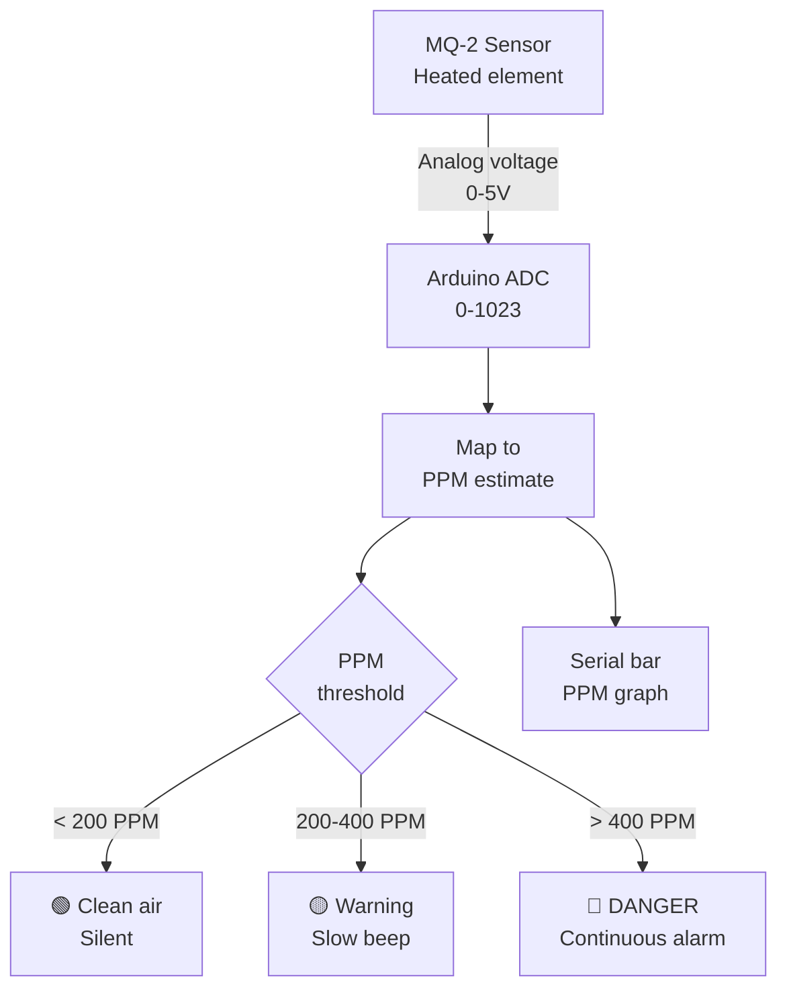

# MQ-2 Gas Sensor — Smoke & Air Quality Monitor

> MQ-2 · Buzzer · LED Bar · Arduino

Detects combustible gases (LPG, methane, smoke, alcohol, hydrogen) via analog resistance change. Displays a live PPM bar in Serial Monitor, triggers a graded alert at configurable thresholds, and sounds an alarm on danger-level readings.

---

## Demo
> 📷 _Add photo to `assets/` and link here_

---

## Pipeline



> ⚠️ MQ-2 needs a 60-second warm-up time on first power-on for accurate readings.

---

## Components

| Component | Qty |
|-----------|-----|
| Arduino Uno/Mega | 1 |
| MQ-2 Gas Sensor Module | 1 |
| Piezo Buzzer | 1 |
| Green, Yellow, Red LEDs | 1 each |

---

## Wiring

```
MQ-2 Module      Arduino
───────────      ───────
VCC     ──────► 5V
GND     ──────► GND
A0      ──────► A0 (analog)
D0      ──────► Pin 2 (digital threshold — optional)

Green LED  ──► Pin 5
Yellow LED ──► Pin 6
Red LED    ──► Pin 7
Buzzer     ──► Pin 8
```

---

## Code

```cpp
const int GAS_PIN = A0;
const int LED_G = 5, LED_Y = 6, LED_R = 7, BUZZER = 8;
const int WARN_THRESHOLD   = 200;
const int DANGER_THRESHOLD = 400;

void printBar(int ppm) {
  int bars = map(constrain(ppm, 0, 600), 0, 600, 0, 30);
  Serial.print("PPM ~"); Serial.print(ppm); Serial.print(" [");
  for (int i=0;i<30;i++) Serial.print(i < bars ? "#" : " ");
  Serial.println("]");
}

void setup() {
  Serial.begin(9600);
  pinMode(LED_G,OUTPUT); pinMode(LED_Y,OUTPUT);
  pinMode(LED_R,OUTPUT); pinMode(BUZZER,OUTPUT);
  Serial.println("MQ-2 warming up — wait 60 seconds for accurate readings...");
  delay(60000);
  Serial.println("Ready");
}

void loop() {
  int raw = analogRead(GAS_PIN);
  int ppm = map(raw, 0, 1023, 0, 600); // Rough estimate — calibrate for precision
  printBar(ppm);

  if (ppm < WARN_THRESHOLD) {
    digitalWrite(LED_G,HIGH); digitalWrite(LED_Y,LOW); digitalWrite(LED_R,LOW);
    noTone(BUZZER);
  } else if (ppm < DANGER_THRESHOLD) {
    digitalWrite(LED_G,LOW); digitalWrite(LED_Y,HIGH); digitalWrite(LED_R,LOW);
    tone(BUZZER, 1200, 100); delay(900);
  } else {
    digitalWrite(LED_G,LOW); digitalWrite(LED_Y,LOW); digitalWrite(LED_R,HIGH);
    tone(BUZZER, 2500);
    delay(200);
  }
  delay(300);
}
```

---

## How to run

1. Wire and upload. The sketch waits 60 seconds for the sensor to warm up.
2. After warm-up, bring a lighter (unlit, gas only) or alcohol near the sensor to test.
3. Adjust `WARN_THRESHOLD` and `DANGER_THRESHOLD` based on your calibration.
