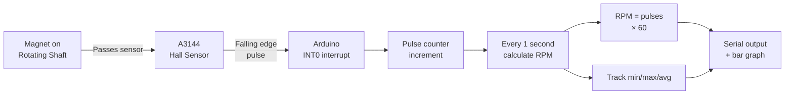

# Hall Effect Sensor — RPM & Tachometer

> A3144 Hall Sensor · Interrupt · Arduino

Counts magnetic pulses from a rotating shaft using a hardware interrupt for precision. Calculates RPM, displays it live on Serial, and logs min/max/average. Works for motors, fans, turbines — any rotating shaft with a small magnet attached.

---

## Demo
> 📷 _Add photo to `assets/` and link here_

---

## Pipeline



---

## Components

| Component | Qty |
|-----------|-----|
| Arduino Uno/Mega | 1 |
| A3144 Hall Effect Sensor | 1 |
| Small neodymium magnet | 1 |
| 10kΩ pull-up resistor | 1 |

---

## Wiring

```
A3144 Sensor     Arduino
────────────     ───────
VCC (pin 1)──► 5V
GND (pin 2)──► GND
OUT (pin 3)──► Pin 2 (INT0) + 10kΩ pull-up to 5V

Attach neodymium magnet to rotating shaft.
Position sensor 1–3 mm from magnet path.
```

---

## Code

```cpp
const int HALL_PIN = 2;
volatile unsigned long pulseCount = 0;
unsigned long lastCalc = 0;
float rpm = 0, rpmMin = 99999, rpmMax = 0, rpmSum = 0;
unsigned long samples = 0;

void IRAM_ATTR onPulse() { pulseCount++; }

void setup() {
  Serial.begin(115200);
  pinMode(HALL_PIN, INPUT_PULLUP);
  attachInterrupt(digitalPinToInterrupt(HALL_PIN), onPulse, FALLING);
  Serial.println("RPM Tachometer — Ready");
  Serial.println("RPM\t\tMin\tMax\tAvg");
}

void loop() {
  if (millis() - lastCalc < 1000) return;
  lastCalc = millis();

  noInterrupts();
  unsigned long count = pulseCount;
  pulseCount = 0;
  interrupts();

  rpm = count * 60.0; // 1 magnet = 1 pulse/rev
  if (rpm > 0) {
    rpmMin = min(rpmMin, rpm);
    rpmMax = max(rpmMax, rpm);
    rpmSum += rpm; samples++;
  }

  int bars = map(constrain(rpm, 0, 3000), 0, 3000, 0, 20);
  Serial.print("RPM: "); Serial.print((int)rpm);
  Serial.print("\t[");
  for (int i=0;i<20;i++) Serial.print(i < bars ? "#" : " ");
  Serial.print("] Min:"); Serial.print((int)rpmMin);
  Serial.print(" Max:"); Serial.print((int)rpmMax);
  if (samples > 0) { Serial.print(" Avg:"); Serial.print((int)(rpmSum/samples)); }
  Serial.println();
}
```

---

## How to run

1. Glue a small magnet to the shaft (off-center, facing outward).
2. Position sensor 1–3 mm from the magnet's sweep path.
3. Upload. Open Serial Monitor at **115200 baud**.
4. Spin the shaft — RPM updates every second.
5. For multi-pole setups (e.g. 4 magnets), divide `rpm` by the pole count.
