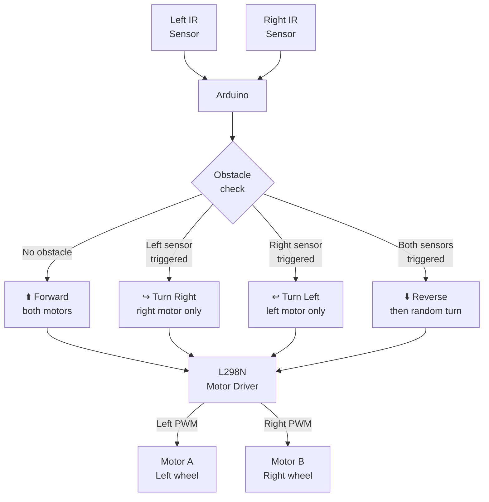

# Infrared Sensor — Obstacle Avoidance Robot

> 2× IR Sensors · Arduino · L298N Motor Driver · 2WD Chassis

A two-wheeled robot that navigates autonomously using two IR obstacle sensors. When a sensor detects an object, the robot steers away; if both sensors trigger simultaneously, it reverses and turns. Classic entry point into mobile robotics.

---

## Demo

> 📷 _Add your robot photo or video to `assets/` and link it here_
> <!--  -->

**Reference guide:** [Instructables — IR Obstacle Avoidance Sensor](https://www.instructables.com/How-to-Use-the-IR-Obstacle-Avoidance-Sensor-on-Ard/)

---

## Pipeline



---

## Components

| Component | Qty | Notes |
|-----------|-----|-------|
| Arduino Uno / Mega | 1 | |
| IR Obstacle Sensor Module | 2 | Left and right |
| L298N Motor Driver | 1 | Dual H-bridge |
| DC Gear Motor | 2 | 3–6V, with wheels |
| 2WD Robot Chassis | 1 | With wheels + caster |
| 7.4V LiPo or 4×AA battery | 1 | Motor power |
| Jumper wires | — | |

---

## Wiring

```
IR Sensors         Arduino
──────────         ───────
Left OUT   ──────► Pin 2
Right OUT  ──────► Pin 3
Both VCC   ──────► 5V
Both GND   ──────► GND

L298N Motor Driver  Arduino
──────────────────  ───────
IN1         ──────► Pin 8    (Left motor direction A)
IN2         ──────► Pin 9    (Left motor direction B)
IN3         ──────► Pin 10   (Right motor direction A)
IN4         ──────► Pin 11   (Right motor direction B)
ENA         ──────► Pin 5    (Left motor speed, PWM)
ENB         ──────► Pin 6    (Right motor speed, PWM)
GND         ──────► Arduino GND + Battery GND
12V         ──────► Battery +

Note: IR sensor OUT is ACTIVE-LOW (LOW = obstacle detected)
```

---

## Code

```cpp
// Obstacle Avoidance Robot — 2× IR sensors + L298N

// IR sensors (Active-LOW: LOW = obstacle)
const int IR_LEFT  = 2;
const int IR_RIGHT = 3;

// L298N motor driver
const int IN1 = 8,  IN2 = 9;   // Left motor
const int IN3 = 10, IN4 = 11;  // Right motor
const int ENA = 5,  ENB = 6;   // Speed (PWM)

const int BASE_SPEED = 160;    // 0–255

void motorLeft(int speed) {   // + = forward, - = backward
  if (speed >= 0) { digitalWrite(IN1, HIGH); digitalWrite(IN2, LOW);  }
  else            { digitalWrite(IN1, LOW);  digitalWrite(IN2, HIGH); speed = -speed; }
  analogWrite(ENA, speed);
}

void motorRight(int speed) {
  if (speed >= 0) { digitalWrite(IN3, HIGH); digitalWrite(IN4, LOW);  }
  else            { digitalWrite(IN3, LOW);  digitalWrite(IN4, HIGH); speed = -speed; }
  analogWrite(ENB, speed);
}

void forward()  { motorLeft(BASE_SPEED);  motorRight(BASE_SPEED);  }
void backward() { motorLeft(-BASE_SPEED); motorRight(-BASE_SPEED); }
void turnLeft() { motorLeft(-BASE_SPEED); motorRight(BASE_SPEED);  }
void turnRight(){ motorLeft(BASE_SPEED);  motorRight(-BASE_SPEED); }
void stopAll()  { motorLeft(0);           motorRight(0);           }

void setup() {
  Serial.begin(9600);
  pinMode(IR_LEFT,  INPUT);
  pinMode(IR_RIGHT, INPUT);
  for (int p : {IN1,IN2,IN3,IN4,ENA,ENB}) pinMode(p, OUTPUT);
  Serial.println("Obstacle Avoidance Robot — Ready");
}

void loop() {
  bool leftBlocked  = digitalRead(IR_LEFT)  == LOW; // Active-LOW
  bool rightBlocked = digitalRead(IR_RIGHT) == LOW;

  if (!leftBlocked && !rightBlocked) {
    forward();
    Serial.println("Forward");

  } else if (leftBlocked && !rightBlocked) {
    turnRight();
    Serial.println("Turn Right");
    delay(300);

  } else if (!leftBlocked && rightBlocked) {
    turnLeft();
    Serial.println("Turn Left");
    delay(300);

  } else {
    // Both blocked — reverse then random turn
    backward();
    Serial.println("Reverse");
    delay(500);
    if (random(2)) turnLeft(); else turnRight();
    delay(400);
  }

  delay(50);
}
```

---

## How to run

1. Assemble chassis with motors and wheels.
2. Mount two IR sensors at the front, pointing forward and slightly down.
3. Wire as shown above — motor power from battery, logic power from Arduino.
4. Upload `code.ino`.
5. Power on — robot starts navigating immediately.
6. Adjust IR sensor potentiometers to set detection distance (~10–20 cm works well for robots).

---

## Real-world applications

- Autonomous mobile robot (AMR) base
- Warehouse navigation (line-following variant)
- Toy/educational robotics
- Entry point toward full ROS-based robotics with Jetson
