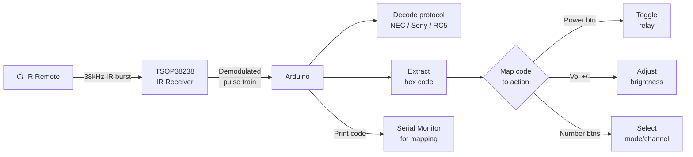

# IR Remote — Decoder & Device Controller

> TSOP38238 IR Receiver · Arduino · IRremote Library

Decodes any IR remote control signal (NEC, Sony, RC5, Samsung protocols). Maps button codes to actions — perfect for controlling lights, relays, or robots with an existing TV/AC remote.

---

## Demo
> 📷 _Add photo to `assets/` and link here_

---

## Pipeline



---

## Components

| Component | Qty |
|-----------|-----|
| Arduino Uno/Mega | 1 |
| TSOP38238 (or TSOP4838) IR Receiver | 1 |
| Any IR remote | 1 |
| LED + 220Ω | 1 |

**Library:** `IRremote` by shirriff/z3t0 — Library Manager.

---

## Wiring

```
TSOP38238        Arduino
─────────        ───────
Pin 1 (OUT) ──► Pin 11
Pin 2 (GND) ──► GND
Pin 3 (VCC) ──► 5V

LED ──► Pin 13 (built-in)
```

---

## Code

```cpp
#include <IRremote.hpp>

#define IR_PIN 11
#define LED    13

// Map YOUR remote's codes here (run decoder mode first)
const uint32_t BTN_POWER  = 0xBA45FF00;
const uint32_t BTN_VOL_UP = 0xB847FF00;
const uint32_t BTN_VOL_DN = 0xEA15FF00;

bool ledState = false;
int brightness = 128;

void setup() {
  Serial.begin(9600);
  IrReceiver.begin(IR_PIN, ENABLE_LED_FEEDBACK);
  pinMode(LED, OUTPUT);
  Serial.println("IR Receiver ready. Point remote and press buttons.");
  Serial.println("Codes printed to Serial for mapping.");
}

void loop() {
  if (!IrReceiver.decode()) return;

  uint32_t code = IrReceiver.decodedIRData.decodedRawData;
  String proto  = getProtocolString(IrReceiver.decodedIRData.protocol);

  Serial.print("Protocol: "); Serial.print(proto);
  Serial.print(" | Code: 0x"); Serial.println(code, HEX);

  if (code == BTN_POWER) {
    ledState = !ledState;
    digitalWrite(LED, ledState);
    Serial.println("→ Power toggle");
  } else if (code == BTN_VOL_UP && brightness < 255) {
    brightness = min(255, brightness + 25);
    analogWrite(LED, brightness);
    Serial.print("→ Brightness: "); Serial.println(brightness);
  } else if (code == BTN_VOL_DN && brightness > 0) {
    brightness = max(0, brightness - 25);
    analogWrite(LED, brightness);
    Serial.print("→ Brightness: "); Serial.println(brightness);
  }

  IrReceiver.resume();
  delay(100);
}
```

---

## How to run

1. Install `IRremote` library (v3+). Wire receiver to Pin 11.
2. Upload. Open Serial Monitor (9600). Press buttons — codes appear.
3. Copy codes into the `const uint32_t BTN_*` constants and re-upload.
