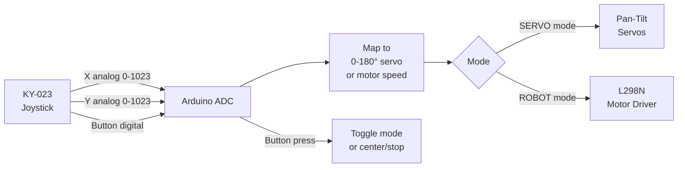

# Analog Joystick — 2-Axis Robot / Servo Controller

> KY-023 Joystick · Arduino · Pan-Tilt Servos or Robot

Reads a 2-axis analog joystick (X/Y potentiometers + click button). Maps axes to two servo motors for a pan-tilt camera mount, or to left/right motor speeds for differential robot drive.

---

## Demo
> 📷 _Add photo to `assets/` and link here_

---

## Pipeline



---

## Components

| Component | Qty |
|-----------|-----|
| Arduino Uno/Mega | 1 |
| KY-023 Joystick Module | 1 |
| SG90 Servos | 2 (servo mode) |
| L298N + DC Motors | (robot mode) |

---

## Wiring

```
KY-023 Joystick    Arduino
───────────────    ───────
VCC       ──────► 5V
GND       ──────► GND
VRx (X)   ──────► A0
VRy (Y)   ──────► A1
SW (btn)  ──────► Pin 2 (INPUT_PULLUP)

Servo pan  ──────► Pin 9
Servo tilt ──────► Pin 10
```

---

## Code (Servo Mode)

```cpp
#include <Servo.h>

const int JOY_X = A0, JOY_Y = A1, JOY_BTN = 2;
Servo panServo, tiltServo;
int panAngle = 90, tiltAngle = 90;

// Deadzone to prevent servo jitter at center
int applyDeadzone(int val, int center = 512, int dz = 40) {
  if (abs(val - center) < dz) return center;
  return val;
}

void setup() {
  Serial.begin(9600);
  panServo.attach(9); tiltServo.attach(10);
  panServo.write(90); tiltServo.write(90);
  pinMode(JOY_BTN, INPUT_PULLUP);
  Serial.println("Joystick Pan-Tilt Controller Ready");
}

void loop() {
  int x = applyDeadzone(analogRead(JOY_X));
  int y = applyDeadzone(analogRead(JOY_Y));
  bool btn = digitalRead(JOY_BTN) == LOW;

  if (btn) {
    panAngle = tiltAngle = 90;
    panServo.write(90); tiltServo.write(90);
    Serial.println("Centered"); delay(500); return;
  }

  panAngle  = map(x, 0, 1023, 0, 180);
  tiltAngle = map(y, 0, 1023, 0, 180);

  panServo.write(panAngle);
  tiltServo.write(tiltAngle);

  Serial.print("Pan:"); Serial.print(panAngle);
  Serial.print(" Tilt:"); Serial.println(tiltAngle);
  delay(30);
}
```

---

## How to run

1. Wire joystick to A0/A1. Wire servos to pins 9/10.
2. Upload. Move joystick — servos follow.
3. Click joystick button to center both servos.
4. For robot mode: replace `panServo`/`tiltServo` writes with `motorLeft(speed)` / `motorRight(speed)` from the infrared-sensor project.
