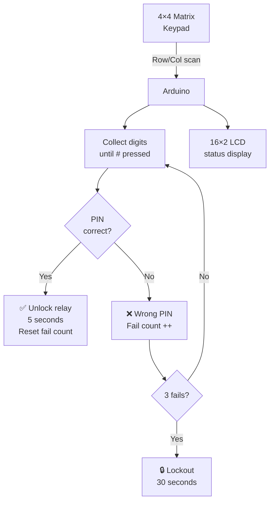

# 4×4 Keypad — Password Lock

> Matrix Keypad · Relay · LCD · Arduino

Password-protected lock using a 4×4 matrix keypad. Enter the PIN → relay unlocks for 5 seconds → re-locks. Wrong PIN increments a fail counter; 3 consecutive fails triggers a lockout. LCD shows real-time feedback.

---

## Demo
> 📷 _Add photo to `assets/` and link here_

---

## Pipeline



---

## Components

| Component | Qty |
|-----------|-----|
| Arduino Uno/Mega | 1 |
| 4×4 Matrix Keypad | 1 |
| 16×2 LCD (I2C) | 1 |
| 5V Relay Module | 1 |
| Green + Red LED | 1 each |

**Library:** `Keypad` by Mark Stanley — Library Manager.

---

## Wiring

```
Keypad rows    ──► Pins 9, 8, 7, 6
Keypad columns ──► Pins 5, 4, 3, 2

LCD I2C SDA ──► A4   SCL ──► A5
Relay IN    ──► Pin 10
Green LED   ──► Pin 11   Red LED ──► Pin 12
```

---

## Code

```cpp
#include <Keypad.h>
#include <Wire.h>
#include <LiquidCrystal_I2C.h>

const byte ROWS = 4, COLS = 4;
char keys[ROWS][COLS] = {
  {'1','2','3','A'}, {'4','5','6','B'},
  {'7','8','9','C'}, {'*','0','#','D'}
};
byte rowPins[4] = {9,8,7,6}, colPins[4] = {5,4,3,2};
Keypad keypad = Keypad(makeKeymap(keys), rowPins, colPins, ROWS, COLS);
LiquidCrystal_I2C lcd(0x27, 16, 2);

const String PASSWORD = "1234";
const int RELAY = 10, LED_OK = 11, LED_FAIL = 12;
String input = "";
int failCount = 0;

void setup() {
  lcd.init(); lcd.backlight();
  pinMode(RELAY, OUTPUT); digitalWrite(RELAY, HIGH);
  pinMode(LED_OK, OUTPUT); pinMode(LED_FAIL, OUTPUT);
  lcd.setCursor(0,0); lcd.print("Enter PIN:");
}

void unlock() {
  lcd.clear(); lcd.print("ACCESS GRANTED");
  digitalWrite(RELAY, LOW); digitalWrite(LED_OK, HIGH);
  delay(5000);
  digitalWrite(RELAY, HIGH); digitalWrite(LED_OK, LOW);
  lcd.clear(); lcd.print("Enter PIN:");
  failCount = 0;
}

void deny() {
  failCount++;
  lcd.clear(); lcd.print("Wrong PIN (" + String(failCount) + "/3)");
  digitalWrite(LED_FAIL, HIGH); delay(1500); digitalWrite(LED_FAIL, LOW);
  if (failCount >= 3) {
    lcd.clear(); lcd.print("LOCKED 30s");
    delay(30000); failCount = 0;
  }
  lcd.clear(); lcd.print("Enter PIN:");
}

void loop() {
  char key = keypad.getKey();
  if (!key) return;
  if (key == '#') {
    if (input == PASSWORD) unlock(); else deny();
    input = "";
  } else if (key == '*') {
    input = "";
    lcd.setCursor(0,1); lcd.print("                ");
  } else {
    input += key;
    lcd.setCursor(0,1);
    for (int i=0;i<input.length();i++) lcd.print('*');
  }
}
```

---

## How to run

1. Install `Keypad` library. Wire keypad rows/cols to the pins above.
2. Change `PASSWORD` to your PIN. Upload.
3. Type PIN on keypad, press `#` to confirm. Press `*` to clear.
