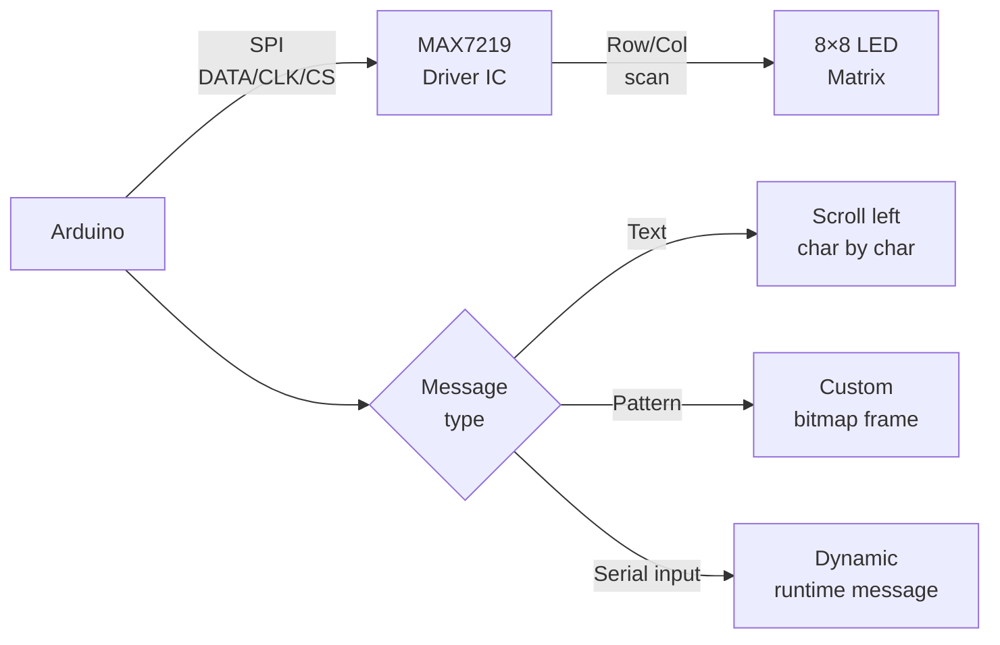

# LED Matrix — Scrolling Text Display

> MAX7219 · 8×8 LED Matrix · Arduino

Drives an 8×8 LED matrix through a single MAX7219 chip over SPI. Displays scrolling text, custom animations, and patterns. Chain multiple modules for wider displays.

---

## Demo
> 📷 _Add photo to `assets/` and link here_

---

## Pipeline



---

## Components

| Component | Qty |
|-----------|-----|
| Arduino Uno/Mega | 1 |
| MAX7219 8×8 LED Matrix Module | 1 |
| Jumper wires | 5 |

**Library:** `MD_Parola` + `MD_MAX72XX` by MajicDesigns — install via Library Manager.

---

## Wiring

```
MAX7219 Module   Arduino
──────────────   ───────
VCC      ──────► 5V
GND      ──────► GND
DIN      ──────► Pin 11 (MOSI)
CLK      ──────► Pin 13 (SCK)
CS       ──────► Pin 10 (SS)
```

---

## Code

```cpp
#include <MD_Parola.h>
#include <MD_MAX72xx.h>
#include <SPI.h>

#define HARDWARE_TYPE MD_MAX72XX::FC16_HW
#define MAX_DEVICES   1
#define CS_PIN        10

MD_Parola display = MD_Parola(HARDWARE_TYPE, CS_PIN, MAX_DEVICES);

const char* messages[] = { "HELLO", "ARDUINO", "EMBEDDED", "AI + HW" };
int msgIndex = 0;

void setup() {
  Serial.begin(9600);
  display.begin();
  display.setIntensity(5);
  display.displayClear();
  display.displayScroll(messages[0], PA_LEFT, PA_SCROLL_LEFT, 60);
  Serial.println("LED Matrix ready. Send text via Serial.");
}

void loop() {
  if (display.displayAnimate()) {
    msgIndex = (msgIndex + 1) % 4;
    display.displayScroll(messages[msgIndex], PA_LEFT, PA_SCROLL_LEFT, 60);
  }
  if (Serial.available()) {
    String msg = Serial.readStringUntil('\n');
    msg.trim();
    if (msg.length() > 0) {
      display.displayScroll(msg.c_str(), PA_LEFT, PA_SCROLL_LEFT, 60);
      Serial.print("Showing: "); Serial.println(msg);
    }
  }
}
```

---

## How to run

1. Install `MD_Parola` and `MD_MAX72XX` via Library Manager.
2. Wire and upload. Matrix scrolls built-in messages on loop.
3. Send any text via Serial Monitor (9600 baud) to display it live.
