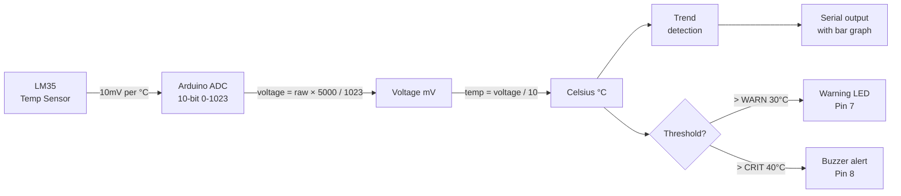

# LM35 Temperature Sensor — Precision Analog Thermometer

> LM35 · Arduino ADC · Serial Logger

Reads the LM35 analog temperature sensor and converts the voltage directly to Celsius without calibration. Displays live readings with a trend indicator (rising/stable/falling), logs min/max, and generates thermal alerts. No library needed — pure math.

---

## Demo
> 📷 _Add photo to `assets/` and link here_

---

## Pipeline



---

## Components

| Component | Qty |
|-----------|-----|
| Arduino Uno/Mega | 1 |
| LM35DZ Temperature Sensor | 1 |
| LED (yellow) | 1 |
| Buzzer | 1 |
| 220Ω resistor | 1 |
| Breadboard | 1 |

> LM35 is **not** LM35D or DHT22 — it outputs analog voltage, not digital. No library required.

---

## Wiring

```
LM35 (TO-92)       Arduino
────────────       ───────
Pin 1 (VCC) ──────► 5V
Pin 2 (Vout)──────► A0
Pin 3 (GND) ──────► GND

Warning LED  ──────► Pin 7 via 220Ω → GND
Buzzer +     ──────► Pin 8
Buzzer -     ──────► GND
```

---

## Code

```cpp
const int LM35_PIN   = A0;
const int WARN_LED   = 7;
const int BUZZ_PIN   = 8;
const float WARN_C   = 30.0;
const float CRIT_C   = 40.0;

float tempMin = 1000, tempMax = -1000;
float prevTemp = -999;
unsigned long lastRead = 0;

float readTempC() {
  long sum = 0;
  for (int i = 0; i < 16; i++) { sum += analogRead(LM35_PIN); delay(2); }
  float voltage = (sum / 16.0) * (5000.0 / 1023.0); // mV
  return voltage / 10.0; // LM35: 10mV per °C
}

char trendChar(float current, float prev) {
  if (prev == -999) return '~';
  if (current > prev + 0.3) return '^';
  if (current < prev - 0.3) return 'v';
  return '~';
}

void setup() {
  Serial.begin(9600);
  pinMode(WARN_LED, OUTPUT);
  pinMode(BUZZ_PIN, OUTPUT);
  Serial.println("LM35 Thermometer — Ready");
  Serial.println("Temp(C)  Trend  Min   Max   Status");
}

void loop() {
  if (millis() - lastRead < 500) return;
  lastRead = millis();

  float temp = readTempC();
  tempMin = min(tempMin, temp);
  tempMax = max(tempMax, temp);
  char trend = trendChar(temp, prevTemp);
  prevTemp = temp;

  int bars = map(constrain((int)temp, 0, 50), 0, 50, 0, 20);
  Serial.print(temp, 1); Serial.print("°C  ");
  Serial.print(trend); Serial.print("  ");
  Serial.print(tempMin, 1); Serial.print("  ");
  Serial.print(tempMax, 1); Serial.print("  [");
  for (int i = 0; i < 20; i++) Serial.print(i < bars ? "#" : " ");
  Serial.print("] ");

  if (temp >= CRIT_C) {
    Serial.println("CRITICAL");
    digitalWrite(WARN_LED, HIGH);
    tone(BUZZ_PIN, 1000, 200);
  } else if (temp >= WARN_C) {
    Serial.println("WARN");
    digitalWrite(WARN_LED, HIGH);
    noTone(BUZZ_PIN);
  } else {
    Serial.println("OK");
    digitalWrite(WARN_LED, LOW);
    noTone(BUZZ_PIN);
  }
}
```

---

## How to run

1. Wire LM35 with flat face toward you: left pin = VCC, center = Vout→A0, right = GND.
2. Upload. Open Serial Monitor at **9600 baud**.
3. Warm the sensor with your fingers — temperature rises, trend shows `^`.
4. Thresholds: 30°C = warning LED, 40°C = buzzer alarm.

> Averaging 16 samples removes ADC noise for ±0.3°C accuracy.
