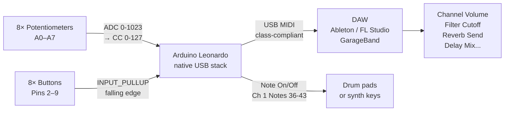

# USB MIDI Controller

> Arduino Leonardo · 8 Potentiometers · 8 Buttons · Native USB MIDI

Turns an Arduino **Leonardo** into a class-compliant USB MIDI device — no drivers, no adapters. Eight potentiometers send Control Change (CC) messages (mapped to volume, cutoff, reverb, etc.), and eight tactile buttons send Note On/Off. Plug into Ableton, FL Studio, GarageBand, or any DAW and it appears as a MIDI device instantly.

---

## Demo
> 📷 _Add photo or video to `assets/`_

---

## Pipeline



---

## Components

| Component | Qty |
|-----------|-----|
| **Arduino Leonardo** (or Pro Micro) | 1 |
| 10kΩ potentiometers | 8 |
| Tactile push buttons | 8 |
| 10kΩ pull-down resistors (optional) | 8 |
| Breadboard | 1 |

> Must use **Leonardo or Pro Micro** — they have native USB HID. Arduino Uno cannot send USB MIDI without a firmware hack.

**Library:** `MIDIUSB` (install via Library Manager)

---

## CC Map (customizable in code)

| Pot | CC# | Default mapping |
|-----|-----|-----------------|
| A0 | 7 | Channel Volume |
| A1 | 74 | Filter Cutoff |
| A2 | 71 | Filter Resonance |
| A3 | 91 | Reverb Send |
| A4 | 93 | Chorus Depth |
| A5 | 94 | Delay Mix |
| A6 | 10 | Pan |
| A7 | 1 | Modulation Wheel |

---

## Wiring

```
Potentiometers
  Left leg  ──► GND
  Right leg ──► 5V
  Wiper     ──► A0..A7

Buttons
  One leg   ──► Pin 2..9
  Other leg ──► GND
  (uses INPUT_PULLUP — no resistor needed)
```

---

## Code

See [code.ino](./code.ino) — implements ADC hysteresis (±3 threshold) to prevent jitter CC floods, button debounce (20ms), and configurable Note/CC maps at the top of the file.
