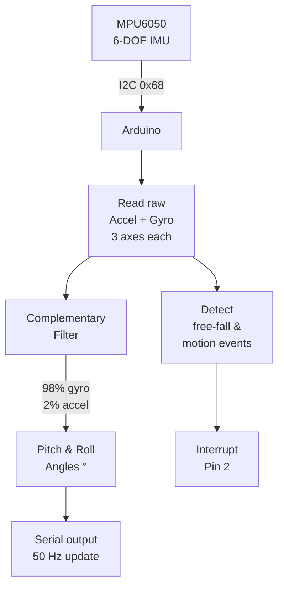

# MPU6050 — Gyroscope & Accelerometer

> MPU6050 IMU · I2C · Arduino

6-axis inertial measurement unit: 3-axis accelerometer + 3-axis gyroscope. Calculates pitch and roll angles using a complementary filter. Outputs real-time orientation data to Serial — foundation of drones, self-balancing robots, and gesture control.

---

## Demo
> 📷 _Add photo to `assets/` and link here_

---

## Pipeline



---

## Components

| Component | Qty |
|-----------|-----|
| Arduino Uno/Mega | 1 |
| MPU6050 Module | 1 |

**Library:** `MPU6050` by Electronic Cats — Library Manager.

---

## Wiring

```
MPU6050      Arduino
───────      ───────
VCC   ──────► 3.3V (some modules accept 5V — check)
GND   ──────► GND
SDA   ──────► A4
SCL   ──────► A5
INT   ──────► Pin 2 (optional — for motion interrupt)
```

---

## Code

```cpp
#include <Wire.h>
#include <MPU6050.h>

MPU6050 mpu;
float pitch = 0, roll = 0;
unsigned long lastTime = 0;

void setup() {
  Serial.begin(115200);
  Wire.begin();
  mpu.initialize();
  if (!mpu.testConnection()) { Serial.println("MPU6050 not found!"); while(1); }
  mpu.setFullScaleGyroRange(MPU6050_GYRO_FS_250);
  mpu.setFullScaleAccelRange(MPU6050_ACCEL_FS_2);
  Serial.println("Pitch,Roll");
  lastTime = millis();
}

void loop() {
  int16_t ax, ay, az, gx, gy, gz;
  mpu.getMotion6(&ax, &ay, &az, &gx, &gy, &gz);

  float dt = (millis() - lastTime) / 1000.0;
  lastTime = millis();

  // Accelerometer angles
  float accelPitch = atan2(ay, az) * 180.0 / PI;
  float accelRoll  = atan2(-ax, az) * 180.0 / PI;

  // Gyro rates (°/s)
  float gyroRateP = gx / 131.0;
  float gyroRateR = gy / 131.0;

  // Complementary filter
  pitch = 0.98 * (pitch + gyroRateP * dt) + 0.02 * accelPitch;
  roll  = 0.98 * (roll  + gyroRateR * dt) + 0.02 * accelRoll;

  Serial.print(pitch, 2); Serial.print(",");
  Serial.println(roll, 2);

  delay(20); // ~50 Hz
}
```

---

## How to run

1. Install `MPU6050` library. Wire to I2C pins (A4/A5).
2. Upload. Open Serial Plotter (Tools → Serial Plotter) at **115200 baud** to see live pitch/roll graphs.
3. Tilt the sensor — pitch and roll angles update in real time.
