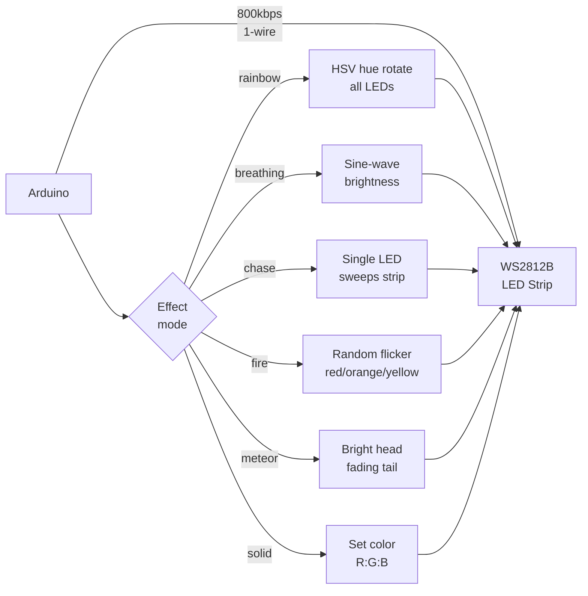

# NeoPixel LED Strip — Programmable Light Effects

> WS2812B · FastLED · Arduino

Drives individually addressable RGB LEDs at up to 800 kbps over a single data line. Implements 6 effects: rainbow, breathing, chase, fire, meteor, and solid color — switchable via Serial command.

---

## Demo
> 📷 _Add a photo or GIF of the effects to `assets/`_

---

## Pipeline



---

## Components

| Component | Qty |
|-----------|-----|
| Arduino Uno/Mega | 1 |
| WS2812B LED Strip (30–60 LEDs) | 1 |
| 5V 2A+ power supply | 1 |
| 300–500Ω resistor | 1 |
| 1000µF capacitor | 1 |

**Library:** `FastLED` by Daniel Garcia — Library Manager.

> ⚡ Power: each LED draws up to 60mA at full white. 60 LEDs = 3.6A — use external 5V PSU, NOT Arduino 5V pin.

---

## Wiring

```
WS2812B Strip    Arduino / PSU
─────────────    ─────────────
5V      ──────► External 5V PSU
GND     ──────► PSU GND + Arduino GND (common)
DIN     ──────► Pin 6 via 300Ω resistor

Add 1000µF cap across 5V/GND at strip start
```

---

## Code

```cpp
#include <FastLED.h>

#define LED_PIN   6
#define NUM_LEDS  30
#define BRIGHTNESS 80

CRGB leds[NUM_LEDS];
String mode = "rainbow";
int hueOffset = 0;

void rainbow()   { for (int i=0;i<NUM_LEDS;i++) leds[i] = CHSV((hueOffset + i*8)%256, 255, 255); hueOffset+=2; }
void chase()     { static int pos=0; fill_solid(leds,NUM_LEDS,CRGB::Black); leds[pos]=CRGB::Cyan; pos=(pos+1)%NUM_LEDS; }
void breathing() { static int v=0,dir=1; fill_solid(leds,NUM_LEDS,CHSV(160,200,v)); v+=dir*3; if(v>=255||v<=0)dir=-dir; }
void fireSim()   { leds[0]=CHSV(random(15,30),255,255); for(int i=NUM_LEDS-1;i>0;i--) leds[i]=leds[i-1].nscale8(200); }
void meteor()    { static int pos=0; for(int i=0;i<NUM_LEDS;i++) leds[i].nscale8(210); leds[pos]=CRGB::White; pos=(pos+1)%NUM_LEDS; }

void setup() {
  Serial.begin(9600);
  FastLED.addLeds<WS2812B, LED_PIN, GRB>(leds, NUM_LEDS);
  FastLED.setBrightness(BRIGHTNESS);
  Serial.println("NeoPixel Ready. Modes: rainbow chase breathing fire meteor solid R:G:B");
}

void loop() {
  if (Serial.available()) {
    mode = Serial.readStringUntil('\n'); mode.trim(); mode.toLowerCase();
  }
  if      (mode == "rainbow")   rainbow();
  else if (mode == "chase")     chase();
  else if (mode == "breathing") breathing();
  else if (mode == "fire")      fireSim();
  else if (mode == "meteor")    meteor();
  else if (mode.startsWith("solid")) {
    int r=0,g=0,b=0; sscanf(mode.c_str(),"solid %d:%d:%d",&r,&g,&b);
    fill_solid(leds, NUM_LEDS, CRGB(r, g, b));
  }
  FastLED.show(); delay(30);
}
```

---

## How to run

1. Install `FastLED`. Wire with resistor on data line, common GND.
2. Upload. Default effect is rainbow.
3. Serial Monitor → send: `chase`, `fire`, `meteor`, `breathing`, `solid 255:0:128`.
