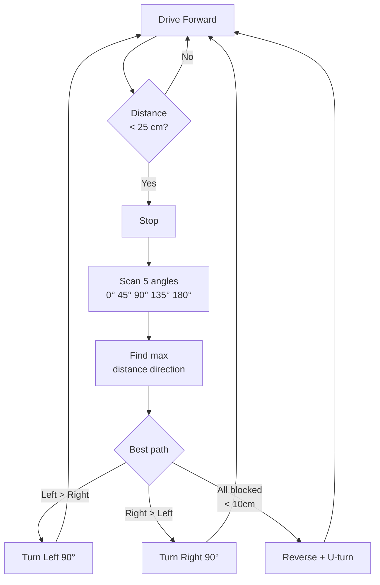

# Autonomous Obstacle-Avoiding Robot

> HC-SR04 + Servo Scan · L298N · Decision Tree · Arduino

A self-driving robot that scans its surroundings with an ultrasonic sensor mounted on a servo, builds a 5-point distance map (left-45°, left, center, right, right-45°), then chooses the best escape path. Goes beyond simple "if obstacle turn right" — it picks the direction with the **most open space**.

---

## Demo
> 📷 _Add video to `assets/`_

---

## Pipeline



---

## Components

| Component | Qty |
|-----------|-----|
| Arduino Uno/Mega | 1 |
| HC-SR04 Ultrasonic Sensor | 1 |
| SG90 Servo (for sensor mount) | 1 |
| L298N Motor Driver | 1 |
| DC Gear Motors (TT motors) | 2 |
| Robot chassis with wheels + caster | 1 |
| 7.4V Li-Po or 6× AA battery | 1 |

---

## Wiring

```
HC-SR04:    TRIG──►Pin 7   ECHO──►Pin 6
Servo:      Signal──►Pin 10
L298N:
  ENA──►Pin 3 (PWM)  IN1──►Pin 8  IN2──►Pin 9
  ENB──►Pin 5 (PWM)  IN3──►Pin 11 IN4──►Pin 12
  Motor A ──► Left wheels    Motor B ──► Right wheels
  12V ──► Battery   5V/GND ──► Arduino (from L298N on-board reg)
```

---

## Scan Pattern

```
     180°  135°  90°   45°   0°
      |     |     |     |    |
      ←─────────[🤖]─────────→
   Far left         Far right
```

Robot stops, sweeps sensor across all 5 angles, picks the direction with maximum clearance.

---

## Code

See [code.ino](./code.ino) — non-blocking motor timing for turns, servo settle delay, median of 3 pings per angle for noise immunity, configurable `SAFE_DIST`, `TURN_SPEED`, and `BASE_SPEED`.
