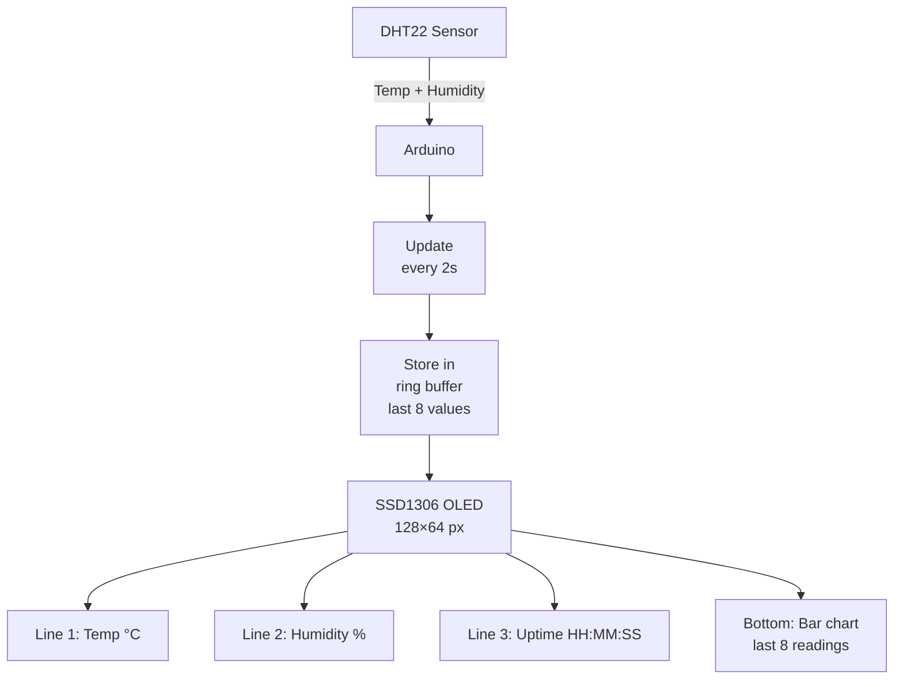

# OLED Display — Mini System Monitor

> SSD1306 128×64 · DHT22 · Arduino

Drives a 128×64 OLED display over I2C. Shows a live dashboard: temperature, humidity, uptime, and a scrolling bar chart of the last 8 temperature readings. No PC needed — standalone embedded display.

---

## Demo
> 📷 _Add photo to `assets/` and link here_

---

## Pipeline



---

## Components

| Component | Qty |
|-----------|-----|
| Arduino Uno/Mega | 1 |
| SSD1306 OLED 128×64 I2C | 1 |
| DHT22 Sensor | 1 |
| 10kΩ resistor | 1 |

**Libraries:** `Adafruit SSD1306` · `Adafruit GFX Library` · `DHT sensor library`

---

## Wiring

```
OLED SSD1306     Arduino
────────────     ───────
SDA     ──────► A4
SCL     ──────► A5
VCC     ──────► 3.3V or 5V (check your module)
GND     ──────► GND

DHT22 DATA ──► Pin 2 (+ 10kΩ pull-up to 5V)
```

---

## Code

```cpp
#include <Wire.h>
#include <Adafruit_GFX.h>
#include <Adafruit_SSD1306.h>
#include <DHT.h>

#define SCREEN_W 128
#define SCREEN_H  64
Adafruit_SSD1306 oled(SCREEN_W, SCREEN_H, &Wire, -1);
DHT dht(2, DHT22);

float tempHistory[8] = {0};
int histIdx = 0;

void setup() {
  oled.begin(SSD1306_SWITCHCAPVCC, 0x3C);
  oled.clearDisplay(); oled.setTextColor(WHITE);
  dht.begin();
}

void drawBarChart() {
  float minV = 15, maxV = 35;
  int chartY = 46, chartH = 14, barW = 12, gap = 4;
  for (int i = 0; i < 8; i++) {
    int barH = map(tempHistory[(histIdx + i) % 8] * 10, minV * 10, maxV * 10, 0, chartH);
    barH = constrain(barH, 1, chartH);
    int x = i * (barW + gap);
    oled.fillRect(x, chartY + chartH - barH, barW, barH, WHITE);
  }
}

void loop() {
  float t = dht.readTemperature();
  float h = dht.readHumidity();
  if (isnan(t)) { delay(2000); return; }

  tempHistory[histIdx] = t;
  histIdx = (histIdx + 1) % 8;

  unsigned long s = millis() / 1000;

  oled.clearDisplay();
  oled.setTextSize(1); oled.setCursor(0,0);
  oled.print("Temp:  "); oled.print(t,1); oled.println(" C");
  oled.print("Humid: "); oled.print(h,1); oled.println(" %");
  oled.print("Up: ");
  if (s/3600 < 10) oled.print("0"); oled.print(s/3600); oled.print(":");
  if ((s%3600)/60 < 10) oled.print("0"); oled.print((s%3600)/60); oled.print(":");
  if (s%60 < 10) oled.print("0"); oled.println(s%60);
  oled.drawFastHLine(0, 43, 128, WHITE);
  drawBarChart();
  oled.display();
  delay(2000);
}
```

---

## How to run

1. Install all three Adafruit libraries. Wire OLED and DHT22.
2. Upload — OLED immediately shows the live dashboard and bar chart.
3. If blank: scan I2C address with I2C Scanner sketch; update `0x3C` if needed.
