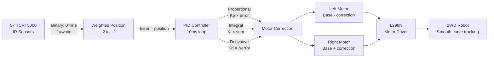

# PID Line Following Robot

> 5× TCRT5000 · L298N · PID Control · Arduino

A differential-drive robot that tracks a black line on white surface using **PID control** across a 5-sensor IR array. The weighted sensor position becomes the error signal fed into the PID loop, which continuously adjusts left/right motor speeds for smooth, high-speed curve tracking — far superior to simple bang-bang control.

---

## Demo
> 📷 _Add GIF or video to `assets/`_

---

## Pipeline



---

## Components

| Component | Qty |
|-----------|-----|
| Arduino Uno/Mega | 1 |
| TCRT5000 IR sensor modules | 5 |
| L298N motor driver | 1 |
| DC gear motors (3–6V) | 2 |
| Robot chassis | 1 |
| Li-Po or 4×AA battery pack | 1 |

---

## Sensor Array Layout

```
Left   ←  [S0] [S1] [S2] [S3] [S4]  → Right
Pins:      A0   A1   A2   A3   A4

Sensor weights: S0=-2, S1=-1, S2=0, S3=+1, S4=+2
Position = weighted average of sensors reading line (LOW)
```

---

## Wiring

```
TCRT5000 (×5): VCC→5V, GND→GND, DO→A0..A4

L298N
  ENA ──► Pin 3 (PWM)    IN1 ──► Pin 8    IN2 ──► Pin 9
  ENB ──► Pin 5 (PWM)    IN3 ──► Pin 10   IN4 ──► Pin 11
  12V ──► Battery +       GND ──► Battery -  + Arduino GND
```

---

## PID Tuning

| Param | Role | Typical start |
|-------|------|---------------|
| BASE_SPEED | Motor base PWM | 120 |
| Kp | Snap to line | 25 |
| Ki | Eliminate drift | 0.0 |
| Kd | Damp oscillation | 15 |

Serial: `KP:30` `KD:20` `SPEED:140` `STOP` `GO`

---

## Code

See [code.ino](./code.ino) — uses digital sensor reads, weighted-average position error, derivative anti-kick on setpoint change, and motor PWM clamping at 255/-255.
