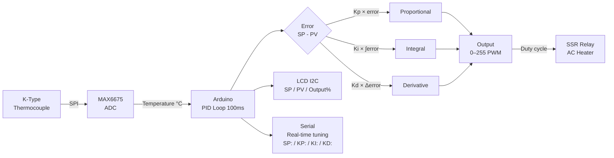

# PID Temperature Controller

> MAX6675 Thermocouple · PID Algorithm · SSR Relay · LCD I2C

Implements a full **PID closed-loop controller** that holds a target temperature to within ±0.5°C. Reads a K-type thermocouple via MAX6675 SPI, drives a Solid State Relay (SSR) with PWM duty cycling, and shows setpoint/actual/error on a 16×2 LCD. Covers the real engineering behind reflow ovens, incubators, and kilns.

---

## Demo
> 📷 _Add photo or video to `assets/`_

---

## Pipeline



---

## Components

| Component | Qty |
|-----------|-----|
| Arduino Uno/Mega | 1 |
| MAX6675 module + K-type thermocouple | 1 |
| Solid State Relay (SSR-40DA) | 1 |
| 16×2 LCD with I2C backpack | 1 |
| 10W+ heating element or heat gun | 1 |

> **Safety:** SSR switches mains voltage. Use a low-voltage heater (12V Nichrome) for testing. Never expose bare mains wiring.

---

## Wiring

```
MAX6675 Module   Arduino
──────────────   ───────
VCC   ─────────► 5V
GND   ─────────► GND
SCK   ─────────► Pin 6
CS    ─────────► Pin 5
SO    ─────────► Pin 4

SSR Input+  ───► Pin 9 (PWM)
SSR Input-  ───► GND

LCD I2C (0x27): SDA→A4, SCL→A5, VCC→5V, GND→GND
```

---

## PID Tuning Reference

| Parameter | Effect | Start value |
|-----------|--------|-------------|
| Kp | Speed of response | 2.0 |
| Ki | Eliminates steady-state error | 0.05 |
| Kd | Damps oscillation | 1.0 |

Serial commands: `SP:150` `KP:2.5` `KI:0.1` `KD:0.8` `AUTO` `MANUAL:50`

---

## Code

See [code.ino](./code.ino) — implements position-form PID with integral windup clamp, output duty-cycle window (250ms), and anti-derivative-kick on setpoint change.
