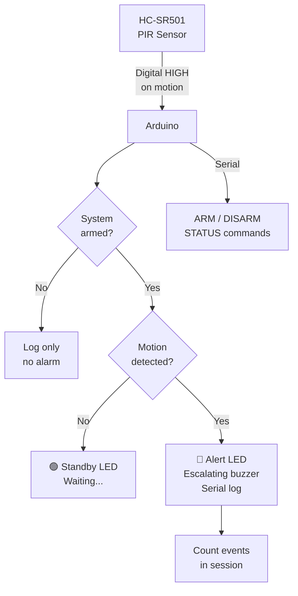

# PIR Motion Sensor — Security Alarm System

> HC-SR501 PIR · Buzzer · LED · Arduino

Passive infrared sensor that detects human body heat movement. Triggers an alarm with escalating buzzer tones and logs timestamped motion events to Serial. Arm/disarm via Serial command.

---

## Demo
> 📷 _Add photo to `assets/` and link here_

---

## Pipeline



---

## Components

| Component | Qty |
|-----------|-----|
| Arduino Uno/Mega | 1 |
| HC-SR501 PIR Sensor | 1 |
| Piezo Buzzer | 1 |
| Green LED + 220Ω | 1 |
| Red LED + 220Ω | 1 |

---

## Wiring

```
PIR HC-SR501     Arduino
────────────     ───────
VCC     ──────► 5V
GND     ──────► GND
OUT     ──────► Pin 2

Green LED ──► Pin 5  (armed/standby)
Red LED   ──► Pin 6  (motion alert)
Buzzer    ──► Pin 8
```

> Adjust PIR sensitivity and delay pots on the sensor board to match your space.

---

## Code

```cpp
const int PIR_PIN    = 2;
const int LED_OK     = 5;
const int LED_ALERT  = 6;
const int BUZZER     = 8;

bool armed       = true;
int  eventCount  = 0;
unsigned long lastMotion = 0;

void alarm() {
  for (int freq = 800; freq <= 2000; freq += 100) {
    tone(BUZZER, freq, 60); delay(70);
  }
  noTone(BUZZER);
}

void setup() {
  Serial.begin(9600);
  pinMode(PIR_PIN, INPUT);
  pinMode(LED_OK, OUTPUT); pinMode(LED_ALERT, OUTPUT); pinMode(BUZZER, OUTPUT);
  Serial.println("PIR Security System Ready");
  Serial.println("Commands: ARM  DISARM  STATUS");
}

void loop() {
  if (Serial.available()) {
    String cmd = Serial.readStringUntil('\n'); cmd.trim(); cmd.toUpperCase();
    if (cmd == "ARM")    { armed = true;  Serial.println("System ARMED"); }
    if (cmd == "DISARM") { armed = false; Serial.println("System DISARMED"); }
    if (cmd == "STATUS") {
      Serial.print("Armed: "); Serial.println(armed ? "YES" : "NO");
      Serial.print("Events this session: "); Serial.println(eventCount);
    }
  }

  bool motion = digitalRead(PIR_PIN) == HIGH;

  if (motion && millis() - lastMotion > 3000) {
    lastMotion = millis();
    eventCount++;
    Serial.print("MOTION DETECTED — event #"); Serial.println(eventCount);
    if (armed) {
      digitalWrite(LED_ALERT, HIGH); digitalWrite(LED_OK, LOW);
      alarm();
      delay(2000);
      digitalWrite(LED_ALERT, LOW);
    }
  }

  if (!motion) {
    digitalWrite(LED_OK, armed); digitalWrite(LED_ALERT, LOW);
  }
  delay(100);
}
```

---

## How to run

1. Wire as shown. Upload. System starts **armed** by default.
2. Walk past sensor — alarm triggers. Session event count increments.
3. Serial Monitor: `DISARM` to silence, `ARM` to re-enable, `STATUS` for counts.
