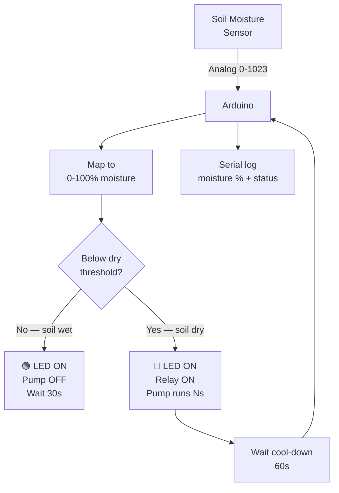

# Automatic Plant Watering System

> Soil Moisture Sensor · Relay · Water Pump · Arduino

Monitors soil moisture every 30 seconds. If the soil drops below a dry threshold, the relay activates a 5V water pump for a configurable burst, then waits before checking again. Prevents both under- and over-watering.

---

## Demo
> 📷 _Add photo to `assets/` and link here_

---

## Pipeline



---

## Components

| Component | Qty |
|-----------|-----|
| Arduino Uno/Mega | 1 |
| Capacitive Soil Moisture Sensor | 1 |
| 5V Relay Module | 1 |
| Submersible Mini Water Pump (5V) | 1 |
| Silicone tubing | — |
| Green LED + 220Ω | 1 |
| Red LED + 220Ω | 1 |

> Use a **capacitive** moisture sensor (not resistive) — resistive sensors corrode quickly in soil.

---

## Wiring

```
Soil Sensor      Arduino
───────────      ───────
VCC     ──────► 3.3V
GND     ──────► GND
AOUT    ──────► A0

Relay Module
IN      ──────► Pin 7
VCC     ──────► 5V
GND     ──────► GND

Pump wired through relay COM/NO terminals
Green LED ──► Pin 5 (+ 220Ω)
Red LED   ──► Pin 6 (+ 220Ω)
```

---

## Code

```cpp
const int MOISTURE_PIN = A0;
const int RELAY_PIN    = 7;
const int LED_OK       = 5;
const int LED_DRY      = 6;

const int DRY_THRESHOLD  = 40;  // % — water if below this
const int PUMP_DURATION  = 3000; // ms — how long pump runs
const int CHECK_INTERVAL = 30000; // ms — check every 30s
const int COOLDOWN       = 60000; // ms — wait after watering

int readMoisture() {
  int raw = analogRead(MOISTURE_PIN);
  // Capacitive: ~600 = dry (air), ~300 = wet — calibrate for your sensor
  return map(constrain(raw, 300, 600), 600, 300, 0, 100);
}

void setup() {
  Serial.begin(9600);
  pinMode(RELAY_PIN, OUTPUT); digitalWrite(RELAY_PIN, HIGH); // Pump OFF
  pinMode(LED_OK, OUTPUT); pinMode(LED_DRY, OUTPUT);
  Serial.println("Plant Watering System — Ready");
}

void loop() {
  int moisture = readMoisture();
  Serial.print("Moisture: "); Serial.print(moisture); Serial.print("% — ");

  if (moisture >= DRY_THRESHOLD) {
    digitalWrite(LED_OK, HIGH); digitalWrite(LED_DRY, LOW);
    Serial.println("OK");
    delay(CHECK_INTERVAL);

  } else {
    digitalWrite(LED_OK, LOW); digitalWrite(LED_DRY, HIGH);
    Serial.print("DRY — watering for "); Serial.print(PUMP_DURATION/1000); Serial.println("s");
    digitalWrite(RELAY_PIN, LOW);   // Pump ON
    delay(PUMP_DURATION);
    digitalWrite(RELAY_PIN, HIGH);  // Pump OFF
    Serial.println("Watering done. Cooldown...");
    delay(COOLDOWN);
  }
}
```

---

## How to run

1. Calibrate: note `analogRead` value in dry air (~600) and fully submerged (~300). Adjust `map()` range.
2. Set `DRY_THRESHOLD`, `PUMP_DURATION`, `CHECK_INTERVAL` to match your plant.
3. Wire pump through relay. Upload and place sensor in soil.
