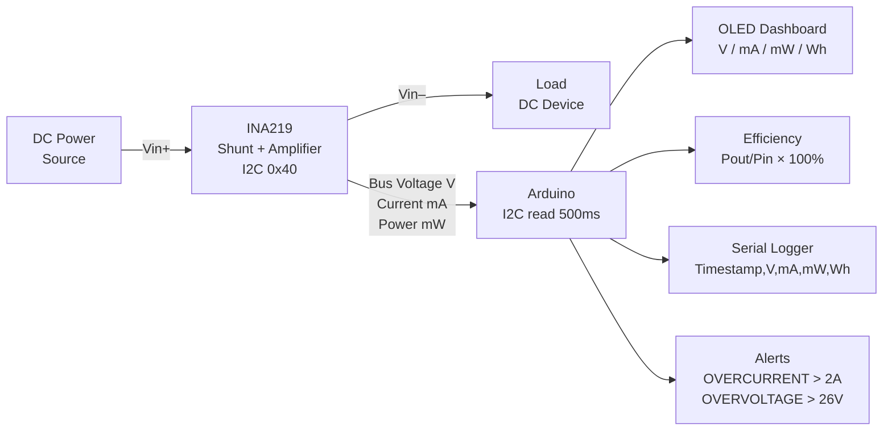

# INA219 Power Monitor — Voltage, Current & Energy Logger

> INA219 · I2C · OLED · Real-time Power Analysis · Arduino

Measures **voltage, current, power, and cumulative energy (Wh)** of any DC load using the INA219 precision current-sense IC. Displays a live dashboard on an OLED, logs min/max/average power, and reports efficiency when monitoring a DC-DC converter or battery charger.

---

## Demo
> 📷 _Add photo to `assets/`_

---

## Pipeline



---

## Components

| Component | Qty |
|-----------|-----|
| Arduino Uno/Mega | 1 |
| INA219 breakout (Adafruit or clone) | 1 |
| SSD1306 0.96" OLED I2C | 1 |
| Red LED (overcurrent alert) | 1 |

**Library:** `Adafruit_INA219`

> INA219 measures up to **26V / 3.2A** with 0.1mA resolution. For higher current, use a lower-value shunt resistor and recalibrate.

---

## Wiring

```
INA219 / OLED (I2C)
  SDA ──► A4    SCL ──► A5    VCC ──► 5V (INA219: 3.3V–5V)

INA219 current path (in series with load):
  VIN+ ──► Power supply positive terminal
  VIN– ──► Load positive input

Alert LED: Pin 7 via 220Ω → GND
```

---

## OLED Display Layout

```
┌────────────────┐
│  12.41V  847mA │  ← Bus voltage + current
│ 10.51W  4.23Wh │  ← Power + cumulative energy
│ Eff: 94.2%     │  ← Optional efficiency channel
│ MAX: 11.2W     │  ← Peak power seen
└────────────────┘
```

---

## Code

See [code.ino](./code.ino) — trapezoidal integration for Wh accumulation, rolling 60-sample moving average for stable readings, configurable alert thresholds via serial.
