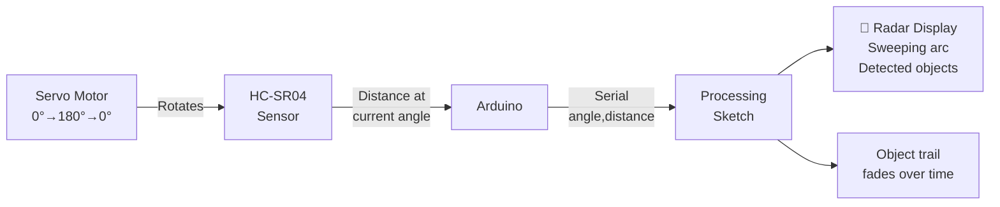

# Radar Scanner — Ultrasonic + Servo + Processing Visualization

> HC-SR04 · Servo · Arduino · Processing IDE

Rotates a servo motor from 0° to 180° while an HC-SR04 measures distance at each angle. Streams angle + distance pairs over Serial to a Processing sketch that renders a real-time radar display — exactly like airport radar.

---

## Demo
> 📷 _Add a screenshot of the Processing radar display to `assets/`_

---

## Pipeline



---

## Components

| Component | Qty |
|-----------|-----|
| Arduino Uno/Mega | 1 |
| HC-SR04 | 1 |
| SG90 Servo | 1 |
| Processing IDE | software |

---

## Wiring

```
HC-SR04          Arduino
────────         ───────
TRIG    ──────► Pin 10
ECHO    ──────► Pin 11
VCC     ──────► 5V
GND     ──────► GND

Servo Signal ──► Pin 12
Servo VCC    ──► 5V
Servo GND    ──► GND
```

---

## Arduino Code

```cpp
#include <Servo.h>

Servo radarServo;
const int TRIG = 10, ECHO = 11, SERVO_PIN = 12;

float measure() {
  digitalWrite(TRIG, LOW); delayMicroseconds(2);
  digitalWrite(TRIG, HIGH); delayMicroseconds(10);
  digitalWrite(TRIG, LOW);
  long d = pulseIn(ECHO, HIGH, 30000);
  return d * 0.0343 / 2.0;
}

void setup() {
  Serial.begin(9600);
  radarServo.attach(SERVO_PIN);
  pinMode(TRIG, OUTPUT); pinMode(ECHO, INPUT);
}

void loop() {
  for (int a = 0; a <= 180; a += 2) {
    radarServo.write(a); delay(30);
    float dist = measure();
    Serial.print(a); Serial.print(","); Serial.println(dist, 1);
  }
  for (int a = 180; a >= 0; a -= 2) {
    radarServo.write(a); delay(30);
    float dist = measure();
    Serial.print(a); Serial.print(","); Serial.println(dist, 1);
  }
}
```

---

## Processing Radar Sketch

```java
// Save as radar.pde — run in Processing IDE
import processing.serial.*;
Serial port;
float angle, distance;
float[] scanned = new float[181];

void setup() {
  size(800, 500); background(0);
  port = new Serial(this, "COM3", 9600); // Change port
  port.bufferUntil('\n');
  java.util.Arrays.fill(scanned, 0);
}

void serialEvent(Serial p) {
  String line = trim(p.readStringUntil('\n'));
  if (line != null && line.contains(",")) {
    String[] parts = split(line, ',');
    if (parts.length == 2) {
      angle = float(parts[0]);
      distance = float(parts[1]);
      if (distance > 0 && distance < 200) scanned[(int)angle] = distance;
    }
  }
}

void draw() {
  fill(0, 40); rect(0, 0, width, height); // Fade trail
  int cx = width/2, cy = height - 20;
  float scale = (cy - 20) / 200.0;
  stroke(0, 255, 0, 60);
  for (int r=50;r<=200;r+=50) ellipse(cx, cy, r*2*scale, r*2*scale);
  // Draw sweeping line
  stroke(0, 255, 0, 200); strokeWeight(2);
  line(cx, cy, cx + cos(radians(180-angle))*(cy-20), cy - sin(radians(180-angle))*(cy-20));
  // Draw detections
  strokeWeight(3); stroke(255, 0, 0);
  for (int a=0;a<181;a++) {
    if (scanned[a] > 0 && scanned[a] < 200) {
      float px = cx + cos(radians(180-a)) * scanned[a] * scale;
      float py = cy - sin(radians(180-a)) * scanned[a] * scale;
      point(px, py);
    }
  }
}
```

---

## How to run

1. Upload Arduino sketch. Mount HC-SR04 on servo horn.
2. Install [Processing IDE](https://processing.org/download).
3. Open `radar.pde`. Change `"COM3"` to your Arduino port.
4. Run Processing — radar display appears, objects show as red dots.
