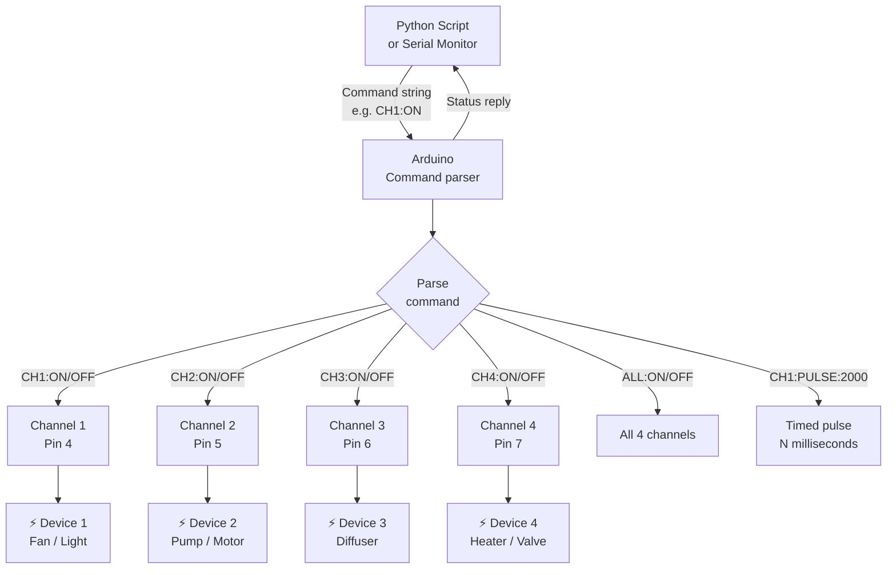

# Relay Control — 4-Channel Smart Power Controller

> 4-Channel Relay · Arduino · Python pyserial · Command protocol

A 4-channel relay controller with a serial command protocol. Control individual channels or all at once from the Serial Monitor or a Python script. Each channel can be switched on, off, toggled, or set to a timed pulse. This is the exact hardware pattern behind S.Y.N.A.P.S.E's diffuser control layer.

---

## Demo

> 📷 _Add your build photo to `assets/` and link it here_
> <!--  -->

**Reference guide:** [Random Nerd Tutorials — Relay Module with Arduino](https://randomnerdtutorials.com/guide-for-relay-module-with-arduino/)

---

## Pipeline



---

## Components

| Component | Qty | Notes |
|-----------|-----|-------|
| Arduino Uno / Mega | 1 | |
| 4-channel 5V Relay Module | 1 | Active-LOW trigger |
| Devices to switch | up to 4 | LEDs, fans, pumps (max rated load) |
| Jumper wires | — | |

> ⚠️ The relay module's high-voltage terminals can carry mains voltage. Only connect low-voltage devices (5–12V DC) unless you are qualified to work with mains electricity.

---

## Wiring

```
Relay Module     Arduino
────────────     ───────
VCC      ──────► 5V
GND      ──────► GND
IN1      ──────► Pin 4   → Channel 1
IN2      ──────► Pin 5   → Channel 2
IN3      ──────► Pin 6   → Channel 3
IN4      ──────► Pin 7   → Channel 4

Note: Module is ACTIVE-LOW
  LOW  signal = relay ON  (circuit closed)
  HIGH signal = relay OFF (circuit open)
```

---

## Command protocol

| Command | Action |
|---------|--------|
| `CH1:ON` | Turn channel 1 ON |
| `CH2:OFF` | Turn channel 2 OFF |
| `CH3:TOGGLE` | Toggle channel 3 |
| `CH1:PULSE:2000` | Channel 1 ON for 2000 ms, then OFF |
| `ALL:ON` | All channels ON |
| `ALL:OFF` | All channels OFF |
| `STATUS` | Print all channel states |

---

## Arduino Code

```cpp
// 4-Channel Relay Controller — Serial command protocol
// Active-LOW relay: LOW = ON, HIGH = OFF

const int RELAY_PINS[4] = {4, 5, 6, 7};
bool channelState[4]    = {false, false, false, false};

void setChannel(int ch, bool on) {
  channelState[ch] = on;
  digitalWrite(RELAY_PINS[ch], on ? LOW : HIGH); // Active-LOW
}

void printStatus() {
  for (int i = 0; i < 4; i++) {
    Serial.print("CH"); Serial.print(i + 1);
    Serial.print(": "); Serial.println(channelState[i] ? "ON" : "OFF");
  }
}

void parseCommand(String cmd) {
  cmd.trim();
  cmd.toUpperCase();

  if (cmd == "STATUS") { printStatus(); return; }

  if (cmd == "ALL:ON")  { for (int i=0;i<4;i++) setChannel(i,true);  Serial.println("All ON");  return; }
  if (cmd == "ALL:OFF") { for (int i=0;i<4;i++) setChannel(i,false); Serial.println("All OFF"); return; }

  // Parse CH<N>:<ACTION>
  if (!cmd.startsWith("CH")) { Serial.println("Unknown command"); return; }

  int ch = cmd.charAt(2) - '1'; // '1'-'4' → 0-3
  if (ch < 0 || ch > 3) { Serial.println("Invalid channel"); return; }

  String action = cmd.substring(4);

  if (action == "ON")     { setChannel(ch, true);  Serial.print("CH"); Serial.print(ch+1); Serial.println(": ON");  }
  else if (action == "OFF")    { setChannel(ch, false); Serial.print("CH"); Serial.print(ch+1); Serial.println(": OFF"); }
  else if (action == "TOGGLE") { setChannel(ch, !channelState[ch]); Serial.print("CH"); Serial.print(ch+1); Serial.println(channelState[ch] ? ": ON" : ": OFF"); }
  else if (action.startsWith("PULSE:")) {
    int ms = action.substring(6).toInt();
    setChannel(ch, true);
    Serial.print("CH"); Serial.print(ch+1); Serial.print(": PULSE "); Serial.print(ms); Serial.println("ms");
    delay(ms);
    setChannel(ch, false);
  } else {
    Serial.println("Unknown action");
  }
}

void setup() {
  Serial.begin(9600);
  for (int i = 0; i < 4; i++) {
    pinMode(RELAY_PINS[i], OUTPUT);
    digitalWrite(RELAY_PINS[i], HIGH); // All OFF on start
  }
  Serial.println("4-Channel Relay Controller Ready");
  Serial.println("Commands: CH1:ON  CH2:OFF  CH3:TOGGLE  CH1:PULSE:2000  ALL:ON  STATUS");
}

void loop() {
  if (Serial.available()) {
    String cmd = Serial.readStringUntil('\n');
    parseCommand(cmd);
  }
}
```

---

## Python controller

```python
import serial
import time

ser = serial.Serial("COM3", 9600, timeout=1)
time.sleep(2)

def cmd(command):
    ser.write((command + "\n").encode())
    time.sleep(0.1)
    while ser.in_waiting:
        print(ser.readline().decode().strip())

# Demo sequence
cmd("STATUS")
cmd("CH1:ON")
time.sleep(1)
cmd("CH2:ON")
time.sleep(1)
cmd("CH1:PULSE:3000")  # ON for 3 seconds
cmd("ALL:OFF")
cmd("STATUS")

ser.close()
```

---

## Connection to S.Y.N.A.P.S.E

S.Y.N.A.P.S.E uses this exact pattern scaled to 8 channels — the Jetson Orin Nano runs a Python process that sends commands over pyserial to an Arduino Mega, which switches ultrasonic diffusers via a relay board based on AI inference results.
