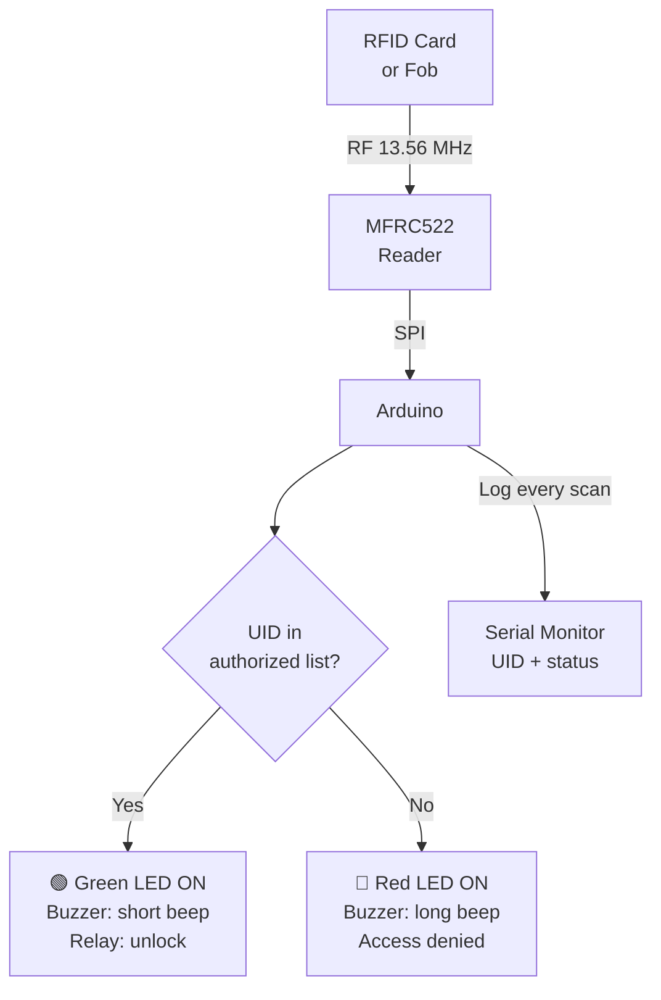

# RFID — Access Control System

> MFRC522 · Arduino · Green/Red LED · Buzzer

Reads RFID cards/fobs via SPI. Compares the UID against an authorized list stored in the sketch. Grants or denies access with LED + buzzer feedback and logs every event to Serial.

---

## Demo
> 📷 _Add photo to `assets/` and link here_

---

## Pipeline



---

## Components

| Component | Qty |
|-----------|-----|
| Arduino Uno/Mega | 1 |
| MFRC522 RFID Module | 1 |
| RFID cards/fobs | 2+ |
| Green LED + 220Ω | 1 |
| Red LED + 220Ω | 1 |
| Piezo Buzzer | 1 |

**Library:** `MFRC522` by GithubCommunity — install via Library Manager.

---

## Wiring

```
MFRC522      Arduino
───────      ───────
SDA   ──────► Pin 10 (SS)
SCK   ──────► Pin 13
MOSI  ──────► Pin 11
MISO  ──────► Pin 12
RST   ──────► Pin 9
3.3V  ──────► 3.3V   ← NOT 5V!
GND   ──────► GND

Green LED ──► Pin 5 (+ 220Ω to GND)
Red LED   ──► Pin 6 (+ 220Ω to GND)
Buzzer    ──► Pin 7
```

---

## Code

```cpp
#include <SPI.h>
#include <MFRC522.h>

#define SS_PIN  10
#define RST_PIN  9
#define LED_OK   5
#define LED_DENY 6
#define BUZZER   7

MFRC522 rfid(SS_PIN, RST_PIN);

// Add your authorized card UIDs here (read them from Serial first)
const String AUTHORIZED[] = {
  "A1 B2 C3 D4",
  "1A 2B 3C 4D"
};
const int AUTH_COUNT = 2;

String getUID() {
  String uid = "";
  for (byte i = 0; i < rfid.uid.size; i++) {
    if (rfid.uid.uidByte[i] < 0x10) uid += "0";
    uid += String(rfid.uid.uidByte[i], HEX);
    if (i < rfid.uid.size - 1) uid += " ";
  }
  uid.toUpperCase();
  return uid;
}

bool isAuthorized(String uid) {
  for (int i = 0; i < AUTH_COUNT; i++)
    if (AUTHORIZED[i] == uid) return true;
  return false;
}

void grantAccess() {
  digitalWrite(LED_OK, HIGH);
  tone(BUZZER, 1000, 200);
  delay(1500);
  digitalWrite(LED_OK, LOW);
}

void denyAccess() {
  digitalWrite(LED_DENY, HIGH);
  tone(BUZZER, 300, 800);
  delay(1500);
  digitalWrite(LED_DENY, LOW);
}

void setup() {
  Serial.begin(9600);
  SPI.begin();
  rfid.PCD_Init();
  pinMode(LED_OK, OUTPUT); pinMode(LED_DENY, OUTPUT); pinMode(BUZZER, OUTPUT);
  Serial.println("RFID Access Control Ready — tap a card");
}

void loop() {
  if (!rfid.PICC_IsNewCardPresent() || !rfid.PICC_ReadCardSerial()) return;
  String uid = getUID();
  Serial.print("Card UID: "); Serial.print(uid);
  if (isAuthorized(uid)) {
    Serial.println(" → ACCESS GRANTED");
    grantAccess();
  } else {
    Serial.println(" → ACCESS DENIED");
    denyAccess();
  }
  rfid.PICC_HaltA();
}
```

---

## How to run

1. Install `MFRC522` library. Wire using **3.3V** — the module is NOT 5V tolerant.
2. Upload, scan your cards. Note UIDs printed to Serial.
3. Add UIDs to the `AUTHORIZED[]` array, re-upload. Cards now grant/deny access.
