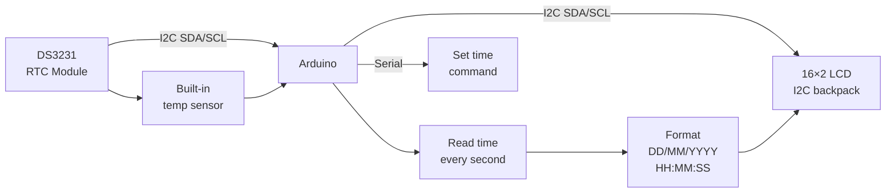

# RTC Clock — Real-Time Clock Dashboard

> DS3231 · 16×2 I2C LCD · Arduino

Battery-backed real-time clock that keeps time even when powered off. Displays date, time, and temperature (DS3231 has a built-in sensor) on a 16×2 LCD. Set time once via Serial; runs forever on its coin cell.

---

## Demo
> 📷 _Add photo to `assets/` and link here_

---

## Pipeline



---

## Components

| Component | Qty |
|-----------|-----|
| Arduino Uno/Mega | 1 |
| DS3231 RTC Module | 1 |
| 16×2 LCD with I2C backpack | 1 |
| CR2032 coin cell | 1 |

**Libraries:** `RTClib` by Adafruit · `LiquidCrystal_I2C` by Frank de Brabander

---

## Wiring

```
DS3231 & LCD I2C (both share the same bus)
──────────────────────────────────────────
SDA  ──────► Arduino A4 (Uno) / Pin 20 (Mega)
SCL  ──────► Arduino A5 (Uno) / Pin 21 (Mega)
VCC  ──────► 5V
GND  ──────► GND

DS3231 I2C address: 0x68
LCD    I2C address: 0x27 (check with I2C scanner if different)
```

---

## Code

```cpp
#include <Wire.h>
#include <RTClib.h>
#include <LiquidCrystal_I2C.h>

RTC_DS3231 rtc;
LiquidCrystal_I2C lcd(0x27, 16, 2);

const char* DAYS[] = {"Sun","Mon","Tue","Wed","Thu","Fri","Sat"};

void setup() {
  Serial.begin(9600);
  Wire.begin();
  lcd.init(); lcd.backlight();

  if (!rtc.begin()) { lcd.print("RTC not found!"); while (1); }
  if (rtc.lostPower()) {
    rtc.adjust(DateTime(F(__DATE__), F(__TIME__))); // Set to compile time
    Serial.println("RTC reset to compile time");
  }

  Serial.println("RTC Clock ready. Send SET:YYYY/MM/DD HH:MM:SS to set time.");
}

void loop() {
  DateTime now = rtc.now();

  // Line 1: Day  DD/MM/YYYY
  lcd.setCursor(0, 0);
  lcd.print(DAYS[now.dayOfTheWeek()]); lcd.print(" ");
  if (now.day()   < 10) lcd.print("0"); lcd.print(now.day());   lcd.print("/");
  if (now.month() < 10) lcd.print("0"); lcd.print(now.month()); lcd.print("/");
  lcd.print(now.year());

  // Line 2: HH:MM:SS  XX.XC
  lcd.setCursor(0, 1);
  if (now.hour()   < 10) lcd.print("0"); lcd.print(now.hour());   lcd.print(":");
  if (now.minute() < 10) lcd.print("0"); lcd.print(now.minute()); lcd.print(":");
  if (now.second() < 10) lcd.print("0"); lcd.print(now.second());
  lcd.print("  ");
  lcd.print(rtc.getTemperature(), 1); lcd.print("C");

  if (Serial.available()) {
    String s = Serial.readStringUntil('\n'); s.trim();
    if (s.startsWith("SET:")) {
      // Format: SET:2025/06/15 14:30:00
      int y = s.substring(4, 8).toInt(),  mo = s.substring(9,11).toInt(),
          d = s.substring(12,14).toInt(), h  = s.substring(15,17).toInt(),
          m = s.substring(18,20).toInt(), sc = s.substring(21,23).toInt();
      rtc.adjust(DateTime(y, mo, d, h, m, sc));
      Serial.println("Time updated");
    }
  }
  delay(1000);
}
```

---

## How to run

1. Install `RTClib` and `LiquidCrystal_I2C`. Wire both modules to I2C pins.
2. On first upload, time is set to compile time automatically.
3. To update: Serial Monitor → send `SET:2025/06/15 14:30:00`.
