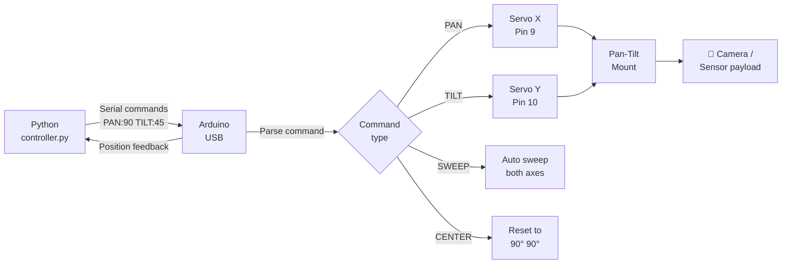

# Servo Motor — Serial-Controlled Pan-Tilt System

> SG90 Servos · Arduino · Python serial controller · 2-axis positioning

A two-axis pan-tilt mount controlled over serial from a Python script on any PC. Send `PAN:90 TILT:45` commands and the servos move smoothly to the target position with interpolated motion. Directly applicable to camera mounts, radar scanners, and robotic heads.

---

## Demo

> 📷 _Add your build photo or video to `assets/` and link it here_
> <!--  -->

**Reference guide:** [Arduino Project Hub — Servo Guide](https://projecthub.arduino.cc/arduino_uno_guy/the-beginners-guide-to-micro-servos-ae2a30)

---

## Pipeline



---

## Components

| Component | Qty | Notes |
|-----------|-----|-------|
| Arduino Uno / Mega | 1 | |
| SG90 Servo | 2 | One for pan (X), one for tilt (Y) |
| Pan-tilt bracket | 1 | 3D-printed or store-bought |
| External 5V supply | optional | Recommended for stable servo power |
| Jumper wires | 6 | |

> ⚠️ Two servos drawing current simultaneously can cause voltage dips that reset the Arduino. Use an external 5V 2A supply for reliable operation.

---

## Wiring

```
Servo PAN (X-axis)      Arduino
──────────────────      ───────
Red   (VCC)     ──────► 5V (or external 5V)
Brown (GND)     ──────► GND
Orange (Signal) ──────► Pin 9

Servo TILT (Y-axis)
──────────────────
Red   (VCC)     ──────► 5V
Brown (GND)     ──────► GND
Orange (Signal) ──────► Pin 10
```

---

## Arduino Code

```cpp
#include <Servo.h>

Servo servoPan;
Servo servoTilt;

const int PAN_PIN  = 9;
const int TILT_PIN = 10;

int currentPan  = 90;
int currentTilt = 90;

void smoothMove(Servo &servo, int &current, int target, int stepDelay = 8) {
  int step = (target > current) ? 1 : -1;
  while (current != target) {
    current += step;
    servo.write(current);
    delay(stepDelay);
  }
}

void parseCommand(String cmd) {
  cmd.trim();

  if (cmd.startsWith("PAN:")) {
    int angle = cmd.substring(4).toInt();
    angle = constrain(angle, 0, 180);
    smoothMove(servoPan, currentPan, angle);
    Serial.print("PAN -> "); Serial.println(angle);

  } else if (cmd.startsWith("TILT:")) {
    int angle = cmd.substring(5).toInt();
    angle = constrain(angle, 0, 180);
    smoothMove(servoTilt, currentTilt, angle);
    Serial.print("TILT -> "); Serial.println(angle);

  } else if (cmd == "CENTER") {
    smoothMove(servoPan,  currentPan,  90);
    smoothMove(servoTilt, currentTilt, 90);
    Serial.println("Centered");

  } else if (cmd == "SWEEP") {
    for (int a = 0; a <= 180; a += 3) {
      servoPan.write(a); servoTilt.write(a); delay(20);
    }
    for (int a = 180; a >= 0; a -= 3) {
      servoPan.write(a); servoTilt.write(a); delay(20);
    }
    currentPan = currentTilt = 0;
    Serial.println("Sweep complete");

  } else {
    Serial.print("Unknown command: "); Serial.println(cmd);
  }
}

void setup() {
  Serial.begin(9600);
  servoPan.attach(PAN_PIN);
  servoTilt.attach(TILT_PIN);
  servoPan.write(90);
  servoTilt.write(90);
  delay(500);
  Serial.println("Pan-Tilt Ready");
  Serial.println("Commands: PAN:<0-180>  TILT:<0-180>  CENTER  SWEEP");
}

void loop() {
  if (Serial.available()) {
    String cmd = Serial.readStringUntil('\n');
    parseCommand(cmd);
  }
}
```

---

## Python controller

```python
import serial
import time

ser = serial.Serial("COM3", 9600, timeout=1)  # Change port as needed
time.sleep(2)  # Wait for Arduino reset

def send(cmd):
    ser.write((cmd + "\n").encode())
    time.sleep(0.1)
    if ser.in_waiting:
        print(ser.readline().decode().strip())

# Example sequence
send("CENTER")
time.sleep(1)
send("PAN:30")
send("TILT:60")
time.sleep(1)
send("SWEEP")
send("CENTER")

ser.close()
```

---

## How to run

1. Wire both servos as shown.
2. Upload `code.ino` to Arduino.
3. **Serial Monitor:** type commands directly (`PAN:45`, `TILT:120`, `CENTER`, `SWEEP`).
4. **Python control:** update `COM3` to your port, run `python controller.py`.

---

## Real-world applications

- Camera surveillance pan-tilt head
- Radar / lidar scanner mount
- Robotic neck / head joint
- Solar tracker (tilt axis + pan axis following sun)
