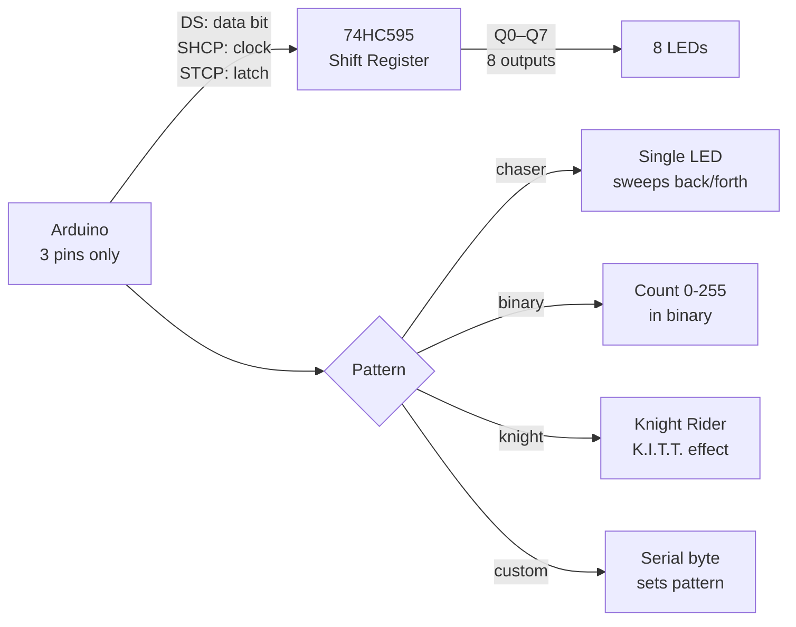

# 74HC595 Shift Register — LED Chaser & Output Expander

> 74HC595 · SPI-like · Arduino

Controls 8 LEDs using only 3 Arduino pins via a shift register. Chain multiple 74HC595s for 16, 24, or 32 outputs from the same 3 pins. Demonstrates serial-to-parallel output expansion — essential for large LED matrices and I/O-constrained projects.

---

## Demo
> 📷 _Add photo or GIF to `assets/` and link here_

---

## Pipeline



---

## Components

| Component | Qty |
|-----------|-----|
| Arduino Uno/Mega | 1 |
| 74HC595 Shift Register IC | 1 |
| LEDs | 8 |
| 220Ω resistors | 8 |
| Breadboard | 1 |

---

## Wiring

```
74HC595 (DIP-16)     Arduino
────────────────     ───────
Pin 14 (DS)   ──────► Pin 11 (data)
Pin 11 (SHCP) ──────► Pin 12 (clock)
Pin 12 (STCP) ──────► Pin 8  (latch)
Pin 10 (/MR)  ──────► 5V (not reset)
Pin 13 (/OE)  ──────► GND (always enabled)
Pin 16 (VCC)  ──────► 5V
Pin 8  (GND)  ──────► GND
Pins Q0-Q7 (15,1-7) → LEDs with 220Ω to GND
```

---

## Code

```cpp
const int DATA_PIN  = 11;
const int CLOCK_PIN = 12;
const int LATCH_PIN = 8;

void shiftOut595(byte val) {
  digitalWrite(LATCH_PIN, LOW);
  shiftOut(DATA_PIN, CLOCK_PIN, MSBFIRST, val);
  digitalWrite(LATCH_PIN, HIGH);
}

String mode = "knight";

void chaser()  { for(int i=0;i<8;i++){shiftOut595(1<<i);delay(80);} for(int i=6;i>0;i--){shiftOut595(1<<i);delay(80);} }
void binary()  { for(int i=0;i<256;i++){shiftOut595(i);delay(60);} }
void knight()  {
  byte k[]={0b00000001,0b00000011,0b00000111,0b00001110,0b00011100,0b00111000,0b01110000,0b11100000,0b01110000,0b00111000,0b00011100,0b00001110,0b00000111,0b00000011};
  for(int i=0;i<14;i++){shiftOut595(k[i]);delay(70);}
}

void setup() {
  Serial.begin(9600);
  pinMode(DATA_PIN,OUTPUT); pinMode(CLOCK_PIN,OUTPUT); pinMode(LATCH_PIN,OUTPUT);
  Serial.println("Shift Register Ready. Modes: chaser  binary  knight  byte:<0-255>");
}

void loop() {
  if (Serial.available()) {
    mode = Serial.readStringUntil('\n'); mode.trim();
    if (mode.startsWith("byte:")) { shiftOut595(mode.substring(5).toInt()); return; }
  }
  if (mode == "chaser") chaser();
  else if (mode == "binary") binary();
  else if (mode == "knight") knight();
}
```

---

## How to run

1. Wire IC as shown. Each Q pin drives one LED through 220Ω.
2. Upload. Default effect is `knight` (K.I.T.T.).
3. Serial: `chaser`, `binary`, `knight`, or `byte:170` (sets specific bit pattern).
