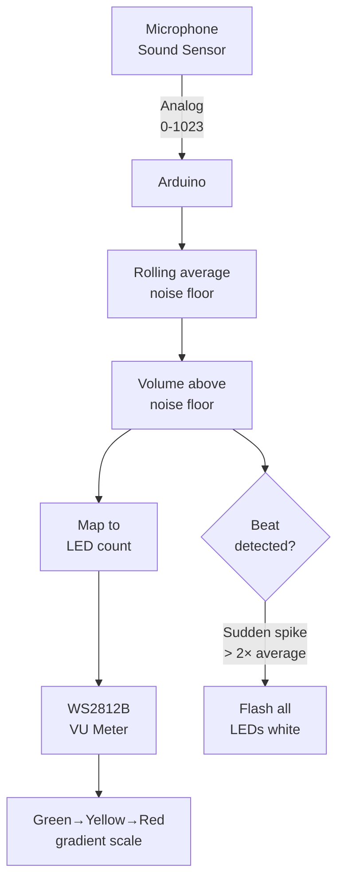

# Sound Reactive — VU Meter & Audio LEDs

> Sound Sensor · NeoPixel Strip · Arduino

Reads ambient sound level via analog microphone module. Drives a NeoPixel strip as a real-time VU meter — quiet = few green LEDs, loud = full strip in red. Beat detection triggers a flash effect.

---

## Demo
> 📷 _Add GIF to `assets/` and link here_

---

## Pipeline



---

## Components

| Component | Qty |
|-----------|-----|
| Arduino Uno/Mega | 1 |
| Analog Sound Sensor (MAX9814 or KY-038) | 1 |
| WS2812B LED Strip (16–30 LEDs) | 1 |
| External 5V PSU | 1 |

**Library:** `FastLED`

---

## Wiring

```
Sound Sensor     Arduino
────────────     ───────
VCC     ──────► 5V
GND     ──────► GND
A0/OUT  ──────► A0

NeoPixel DIN ──► Pin 6 via 300Ω
NeoPixel 5V  ──► External PSU 5V
NeoPixel GND ──► PSU GND + Arduino GND
```

---

## Code

```cpp
#include <FastLED.h>

#define MIC_PIN  A0
#define LED_PIN  6
#define NUM_LEDS 20

CRGB leds[NUM_LEDS];
int noiseFloor = 512;

CRGB vuColor(int ledIndex, int totalActive) {
  float ratio = (float)ledIndex / NUM_LEDS;
  if (ratio < 0.5) return CRGB::Green;
  if (ratio < 0.75) return CRGB(255, 165, 0); // Orange
  return CRGB::Red;
}

void setup() {
  FastLED.addLeds<WS2812B, LED_PIN, GRB>(leds, NUM_LEDS);
  FastLED.setBrightness(80);
  // Calibrate noise floor
  long sum = 0;
  for (int i=0;i<100;i++) { sum += analogRead(MIC_PIN); delay(5); }
  noiseFloor = sum / 100;
}

void loop() {
  int sample = analogRead(MIC_PIN);
  int volume = abs(sample - noiseFloor);

  // Rolling noise floor update
  noiseFloor = 0.99 * noiseFloor + 0.01 * sample;

  int activeLEDs = map(constrain(volume, 0, 300), 0, 300, 0, NUM_LEDS);

  static int prevActive = 0;
  // Smooth decay
  if (activeLEDs < prevActive) activeLEDs = max(activeLEDs, prevActive - 1);
  prevActive = activeLEDs;

  // Beat detect: sudden spike
  static int avgVolume = 0;
  avgVolume = 0.9 * avgVolume + 0.1 * volume;
  if (volume > avgVolume * 2.5 && volume > 80) {
    fill_solid(leds, NUM_LEDS, CRGB::White);
    FastLED.show(); delay(40);
  }

  fill_solid(leds, NUM_LEDS, CRGB::Black);
  for (int i = 0; i < activeLEDs; i++) leds[i] = vuColor(i, activeLEDs);
  FastLED.show();
  delay(10);
}
```

---

## How to run

1. Wire sound sensor to A0. Wire NeoPixel strip with external 5V PSU.
2. Upload. LEDs react to ambient sound in real time.
3. Play music or clap — the bar fills up. Clap hard for the beat flash.
