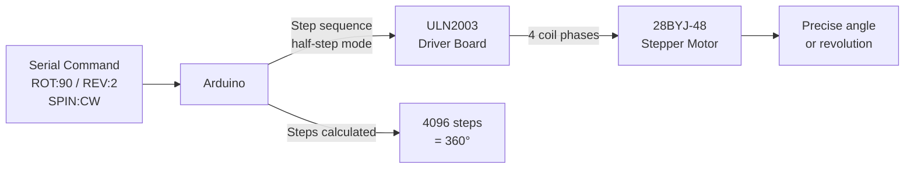

# Stepper Motor — Precise Positioning

> 28BYJ-48 · ULN2003 Driver · Arduino

Drives the 28BYJ-48 stepper with half-step mode for 4096 steps/revolution (~0.088°/step). Serial commands control exact degree rotation, full revolutions, and continuous spin — the basis of CNC, 3D printers, and camera sliders.

---

## Demo
> 📷 _Add photo to `assets/` and link here_

---

## Pipeline



---

## Components

| Component | Qty |
|-----------|-----|
| Arduino Uno/Mega | 1 |
| 28BYJ-48 Stepper Motor | 1 |
| ULN2003 Driver Board | 1 |

**Library:** `Stepper` (built-in Arduino IDE)

---

## Wiring

```
ULN2003 Board    Arduino
─────────────    ───────
IN1      ──────► Pin 8
IN2      ──────► Pin 9
IN3      ──────► Pin 10
IN4      ──────► Pin 11
VCC      ──────► 5V
GND      ──────► GND
Motor connector → 28BYJ-48 (plug directly)
```

---

## Code

```cpp
#include <Stepper.h>

const int STEPS_PER_REV = 2048; // Half-step: 2048 per full rev (32:1 gearbox)
Stepper stepper(STEPS_PER_REV, 8, 10, 9, 11); // Pin order for ULN2003

void setup() {
  Serial.begin(9600);
  stepper.setSpeed(12); // RPM (max ~15 for 28BYJ-48)
  Serial.println("Stepper Ready");
  Serial.println("Commands: ROT:<degrees>  REV:<n>  SPIN:CW  SPIN:CCW  STOP");
}

void loop() {
  if (!Serial.available()) return;
  String cmd = Serial.readStringUntil('\n'); cmd.trim(); cmd.toUpperCase();

  if (cmd.startsWith("ROT:")) {
    float deg = cmd.substring(4).toFloat();
    int steps = (int)(deg / 360.0 * STEPS_PER_REV);
    stepper.step(steps);
    Serial.print("Rotated "); Serial.print(deg); Serial.print("° ("); Serial.print(steps); Serial.println(" steps)");

  } else if (cmd.startsWith("REV:")) {
    int revs = cmd.substring(4).toInt();
    stepper.step(revs * STEPS_PER_REV);
    Serial.print(revs); Serial.println(" revolution(s) done");

  } else if (cmd == "SPIN:CW") {
    Serial.println("Spinning CW — send STOP to halt");
    while (!Serial.available()) stepper.step(10);

  } else if (cmd == "SPIN:CCW") {
    Serial.println("Spinning CCW — send STOP to halt");
    while (!Serial.available()) stepper.step(-10);

  } else {
    Serial.println("Commands: ROT:<deg>  REV:<n>  SPIN:CW  SPIN:CCW");
  }
}
```

---

## How to run

1. Wire ULN2003 board using pin order `8, 10, 9, 11` (important — not sequential).
2. Upload. Open Serial Monitor (9600 baud).
3. Send `ROT:180` (half turn), `REV:3` (3 full turns), `SPIN:CW` (continuous).
