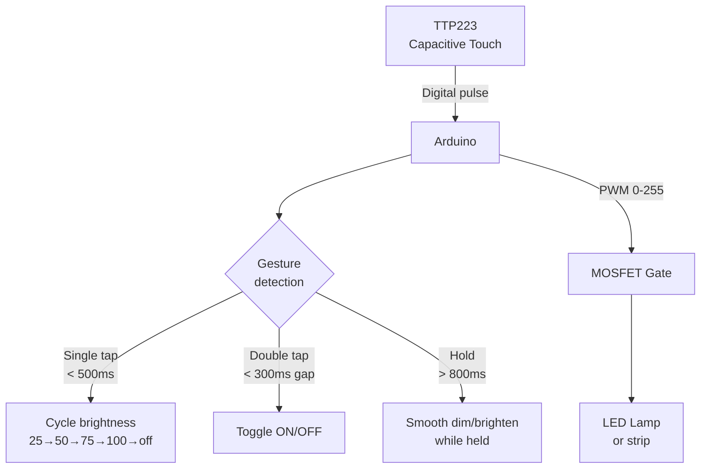

# Capacitive Touch — Smart Touch Lamp

> TTP223 · MOSFET · PWM Dimming · Arduino

Touch-sensitive lamp with three modes: single tap cycles brightness (25% → 50% → 75% → 100%), double tap toggles on/off, and hold dims/brightens gradually. Clean, responsive UX with no mechanical parts.

---

## Demo
> 📷 _Add photo to `assets/` and link here_

---

## Pipeline



---

## Components

| Component | Qty |
|-----------|-----|
| Arduino Uno/Mega | 1 |
| TTP223 Touch Sensor Module | 1 |
| IRLZ44N MOSFET (or STP16NF06) | 1 |
| 12V LED strip or bulb | 1 |
| 10kΩ pull-down resistor | 1 |

> Use a MOSFET (not a relay) for smooth PWM dimming. Relay can only switch on/off.

---

## Wiring

```
TTP223          Arduino
───────         ───────
VCC    ──────► 5V
GND    ──────► GND
OUT    ──────► Pin 2

MOSFET
Gate   ──────► Pin 9 (PWM) via 220Ω
Source ──────► GND
Drain  ──────► LED strip negative
LED strip positive ──► 12V supply
```

---

## Code

```cpp
const int TOUCH_PIN = 2;
const int LED_PIN   = 9; // PWM

const int BRIGHTNESS_STEPS[] = {0, 64, 128, 192, 255};
int stepIdx = 4; // Start at full brightness (ON)
bool lampOn = true;

unsigned long pressStart = 0, lastRelease = 0;
bool wasPressed = false, holding = false;
int holdDir = -1; // -1 = dim, +1 = brighten
int currentBrightness = 255;

void applyBrightness(int b) {
  currentBrightness = constrain(b, 0, 255);
  analogWrite(LED_PIN, lampOn ? currentBrightness : 0);
}

void setup() {
  Serial.begin(9600);
  pinMode(TOUCH_PIN, INPUT);
  pinMode(LED_PIN, OUTPUT);
  applyBrightness(255);
  Serial.println("Touch Lamp Ready");
}

void loop() {
  bool touched = digitalRead(TOUCH_PIN) == HIGH;
  unsigned long now = millis();

  if (touched && !wasPressed) {
    pressStart = now; wasPressed = true; holding = false;
  }

  if (touched && wasPressed && !holding && (now - pressStart > 800)) {
    holding = true; // Long press detected
    holdDir = (currentBrightness > 127) ? -1 : 1;
  }

  if (holding && touched) {
    currentBrightness = constrain(currentBrightness + holdDir * 3, 10, 255);
    applyBrightness(currentBrightness);
    delay(20); return;
  }

  if (!touched && wasPressed) {
    wasPressed = false;
    if (!holding) {
      unsigned long pressDuration = now - pressStart;
      unsigned long gap = now - lastRelease;
      if (gap < 300 && gap > 50) {
        lampOn = !lampOn;
        applyBrightness(currentBrightness);
        Serial.println(lampOn ? "ON" : "OFF");
      } else if (pressDuration < 500) {
        stepIdx = (stepIdx + 1) % 5;
        applyBrightness(BRIGHTNESS_STEPS[stepIdx]);
        Serial.print("Brightness: "); Serial.println(BRIGHTNESS_STEPS[stepIdx]);
      }
      lastRelease = now;
    }
    holding = false;
  }
}
```

---

## How to run

1. Wire MOSFET with gate resistor to PWM pin. Common GND between Arduino and LED supply.
2. Upload. Touch pad to cycle brightness. Double-tap to toggle. Hold to dim/brighten.
