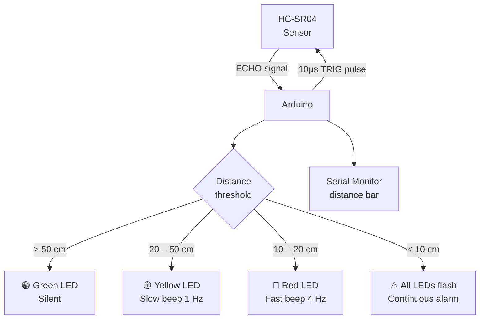

# Ultrasonic Sensor — Smart Parking Sensor

> HC-SR04 · RGB LEDs · Piezo Buzzer · Arduino

A proximity alert system that replicates the parking sensor experience in modern cars. The sensor continuously measures distance; three LEDs and a buzzer give real-time feedback — green when clear, yellow when close, red with alarm when critical.

---

## Demo

> 📷 _Add your build photo or screen recording to `assets/` and link it here_
> <!--  -->

**Reference wiring guide:** [Arduino Project Hub — HC-SR04](https://projecthub.arduino.cc/Isaac100/getting-started-with-the-hc-sr04-ultrasonic-sensor-7cabe1)

---

## Pipeline



---

## Components

| Component | Qty | Notes |
|-----------|-----|-------|
| Arduino Uno / Mega | 1 | |
| HC-SR04 Ultrasonic Sensor | 1 | Range: 2–400 cm |
| Green LED | 1 | 220Ω resistor |
| Yellow LED | 1 | 220Ω resistor |
| Red LED | 1 | 220Ω resistor |
| Piezo Buzzer | 1 | Active or passive |
| 220Ω resistors | 3 | One per LED |
| Breadboard + wires | — | |

---

## Wiring

```
HC-SR04          Arduino
────────         ───────
VCC      ──────► 5V
GND      ──────► GND
TRIG     ──────► Pin 9
ECHO     ──────► Pin 10

LEDs (each with 220Ω to GND)
Green    ──────► Pin 4
Yellow   ──────► Pin 5
Red      ──────► Pin 6

Buzzer
+ (pos)  ──────► Pin 8
- (neg)  ──────► GND
```

---

## Code

```cpp
// Smart Parking Sensor
// HC-SR04 + 3 LEDs + Buzzer — distance-based alert system

const int TRIG_PIN   = 9;
const int ECHO_PIN   = 10;
const int LED_GREEN  = 4;
const int LED_YELLOW = 5;
const int LED_RED    = 6;
const int BUZZER     = 8;

// Distance thresholds (cm)
const float CLEAR    = 50.0;
const float WARNING  = 20.0;
const float DANGER   = 10.0;

float measureDistance() {
  digitalWrite(TRIG_PIN, LOW);
  delayMicroseconds(2);
  digitalWrite(TRIG_PIN, HIGH);
  delayMicroseconds(10);
  digitalWrite(TRIG_PIN, LOW);
  long duration = pulseIn(ECHO_PIN, HIGH, 30000);
  return duration * 0.0343 / 2.0;
}

void setLEDs(bool g, bool y, bool r) {
  digitalWrite(LED_GREEN,  g);
  digitalWrite(LED_YELLOW, y);
  digitalWrite(LED_RED,    r);
}

void printBar(float dist) {
  int bars = constrain((int)(dist / 5), 0, 20);
  Serial.print("[");
  for (int i = 0; i < 20; i++) Serial.print(i < bars ? "█" : " ");
  Serial.print("] ");
  Serial.print(dist, 1);
  Serial.println(" cm");
}

void setup() {
  Serial.begin(9600);
  pinMode(TRIG_PIN,   OUTPUT);
  pinMode(ECHO_PIN,   INPUT);
  pinMode(LED_GREEN,  OUTPUT);
  pinMode(LED_YELLOW, OUTPUT);
  pinMode(LED_RED,    OUTPUT);
  pinMode(BUZZER,     OUTPUT);
}

void loop() {
  float dist = measureDistance();
  printBar(dist);

  if (dist == 0 || dist > 400) {
    setLEDs(0, 0, 0);
    noTone(BUZZER);
  } else if (dist > CLEAR) {
    setLEDs(1, 0, 0);
    noTone(BUZZER);
  } else if (dist > WARNING) {
    setLEDs(0, 1, 0);
    tone(BUZZER, 1000, 100);
    delay(900);
    return;
  } else if (dist > DANGER) {
    setLEDs(0, 0, 1);
    tone(BUZZER, 1500, 80);
    delay(200);
    return;
  } else {
    // Critical — flash all
    bool flash = (millis() / 100) % 2;
    setLEDs(flash, flash, flash);
    tone(BUZZER, 2000);
  }

  delay(100);
}
```

---

## Serial output example

```
[████████████████    ]  42.3 cm
[██████████          ]  26.1 cm   ← yellow zone, slow beep
[████                ]  11.8 cm   ← red zone, fast beep
[██                  ]   7.2 cm   ← ALARM
```

---

## How to run

1. Wire components as shown above.
2. Upload `code.ino` in Arduino IDE.
3. Open Serial Monitor at **9600 baud** to see the live distance bar.
4. Move an object toward the sensor to test all three zones.

---

## Real-world applications

- Car parking assistance systems
- Robot obstacle detection front sensor
- Conveyor belt object detection
- Warehouse shelf proximity alerts
