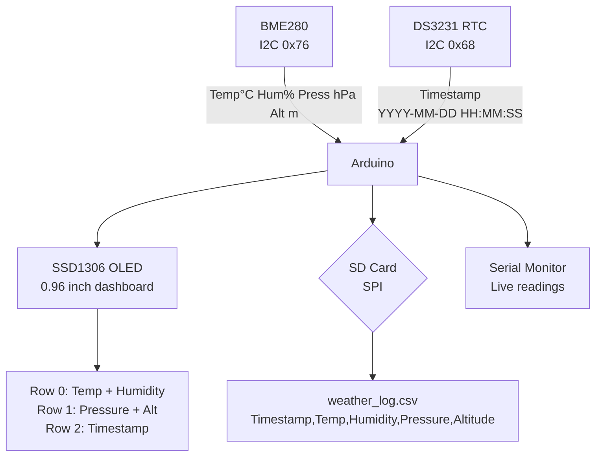

# Weather Station + SD Data Logger

> BME280 · DS3231 RTC · SD Card · OLED · Arduino

Full weather station that reads temperature, humidity, pressure, and altitude from a BME280, timestamps every reading with a DS3231 RTC, logs to a CSV on an SD card, and shows a live dashboard on a 0.96" OLED. Produces files you can open in Excel or plot in Python.

---

## Demo
> 📷 _Add photo to `assets/`_

---

## Pipeline



---

## Components

| Component | Qty |
|-----------|-----|
| Arduino Uno/Mega | 1 |
| BME280 breakout (I2C) | 1 |
| DS3231 RTC module | 1 |
| SSD1306 0.96" OLED I2C | 1 |
| MicroSD card module (SPI) | 1 |
| MicroSD card (any size) | 1 |

**Libraries:** `Adafruit_BME280`, `Adafruit_SSD1306`, `RTClib`, `SD`

---

## Wiring

```
BME280 / DS3231 / OLED (all I2C)
  SDA ──► A4    SCL ──► A5    VCC ──► 3.3V/5V    GND ──► GND

SD Card Module (SPI)
  MOSI ──► Pin 11    MISO ──► Pin 12
  SCK  ──► Pin 13    CS   ──► Pin 4
  VCC  ──► 5V        GND  ──► GND
```

---

## CSV Output Sample

```
Timestamp,Temp_C,Humidity_%,Pressure_hPa,Altitude_m
2025-06-07 14:22:01,23.4,51.2,1013.2,45.1
2025-06-07 14:22:11,23.5,51.0,1013.1,45.2
```

---

## Code

See [code.ino](./code.ino) — logs every 10 seconds, rotates to a new file on date change, handles SD write errors gracefully without halting the display.
